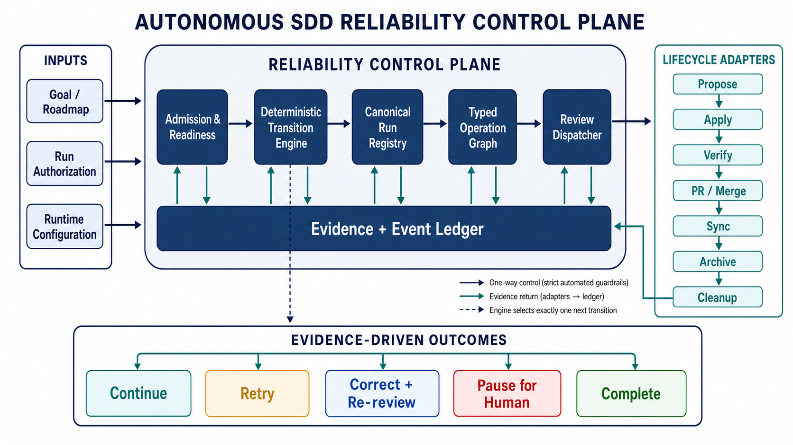

# Autonomous SDD Reliability Control Plane

Date: 2026-08-16

Last updated: 2026-08-22

Status: Accepted architecture with delivered M1 contracts and an accepted
bootstrap/cutover correction. The owner confirmed the deterministic control-
plane direction, durable isolated work units, future Temporal expandability,
the multi-agent operating model, and proof-before-default sequencing. M1-S1,
M1-S2, and M1-S3 are delivered and archived. Later slices still require their
own accepted brief and explicit delivery authorization; this brief does not
authorize implementation or external mutation.

## Document role

This is the main design document for the autonomous SDD reliability control
plane. It owns the whole-system outcome, architecture, safety invariants,
agent roles, harness foundations, shared risks, and open decisions. The
[roadmap](../plans/autonomous-sdd-reliability-control-plane-roadmap.md) owns
only milestone/slice dependency mapping, readiness, execution order, and
milestone exit evidence. The linked detailed slice briefs own slice-specific
implementation design and acceptance evidence, subject to owner review.

The planned-slice inventory preserves architecture-level implementation
direction and links to detailed briefs. Delivered briefs identify their
evidence; undelivered briefs remain planning inputs and do not authorize an
OpenSpec change or implementation.

## 1. Problem and desired outcome

The repository defines a strong intended autonomous SDD lifecycle and strict
independent-review boundary, but it does not yet provide one deterministic
runtime that executes that lifecycle. Policy is distributed across skills,
workflow prose, request resolution, two durable-state shapes, authorization
helpers, review transports, recovery helpers, and model-driven tool calls.
Individual components are well guarded, but their composition is ambiguous.
Different runs can therefore select different helpers, inspect different
worktrees or configuration sources, request approvals at different points, or
classify the same reviewer outcome differently.

The long-term desired outcome is a truly unattended, fail-closed SDD delivery
path that can complete an authorized five-slice milestone over a multi-hour run
when all objective gates pass. It should ask for no routine owner approvals,
stop only for a material decision or a real unrecoverable gate, resume
idempotently after interruption, preserve unrelated dirty work, and make every
stop explainable from one canonical durable record.

The first reliable-release promise is deliberately smaller:

> Given one approved change in one repository, the runner can safely drive it
> from admission through implementation, independent review, OpenSpec Verify,
> and closeout, or stop with an exact actionable reason, without touching
> unrelated work.

The delivery horizons are therefore explicit:

1. **Single-change v1:** one repository, one approved change, one active
   mutating autonomous run, serial role handoffs, explicit pause/resume, strict
   review, full closeout, and repeated qualification against real eligible
   changes.
2. **Milestone expansion:** dependency-valid queues, owner shorthand, isolated
   child work units, and five-slice qualification only after single-change v1
   is proven.
3. **Later concurrency and backend expansion:** fine-grained overlapping-run
   coordination, safe parallel role execution, and optional Temporal only after
   the earlier contracts and qualification evidence are stable.

Success means that autonomy and rigor reinforce each other: scripts own state
selection, transition ordering, authorization, tool transport, retries, and
evidence binding; models own bounded planning, implementation, verification,
and independent review within those fixed transitions.

### Bootstrap, activation, and cutover control lane

The first M1 deliveries exposed a sequencing defect: v2 admission and claims
became live before one released generation could also recover, terminalize,
release, converge external lifecycle state, clean up, and roll back. The
contracts remain valid, but publication and activation are now separate.

The control plane uses five explicit modes:

| Mode | Operational rule |
|---|---|
| `contract-only` | New schemas/helpers may be published and tested, but the existing released lifecycle owner performs every real mutation. |
| `audit/shadow` | The new generation may compare discovery and decisions without writing; the existing released owner remains sole mutator. |
| `bootstrap-hybrid` | One explicitly authorized N-1/bootstrap owner delivers and archives N; N does not prove its own release complete. |
| `qualified-opt-in` | After M4-S4, an individually authorized run may bind one qualified generation as its sole mutating owner. |
| `default` | Only M6-S3 may route new eligible work to the qualified generation by default; in-flight runs retain their immutable owner. |

Exactly one generation owns mutation for a run and repository in every mode.
Publishing a schema, helper, wrapper, or adapter never changes routing or grants
mutation authority. Runtime N-1 delivers and archives runtime N, and N is
installed only afterward for later work. Any task that can finish only by using
the same newly released runtime is self-referential and must be separated
before Propose.

Real ownership activates only when one generation implements and qualifies the
minimum vertical bundle: initialize; claim and generation-fence; advance;
recover/take over; terminalize; release the claim; converge issue, Project, PR,
default-branch, Sync, and Archive state; exact-clean owned resources; and roll
back routing without creating a second authority. Slices may implement parts of
the bundle independently, but no partial horizontal slice activates it.

The accepted detailed correction is
[Stabilize Autonomous SDD Bootstrap and Cutover Plan](stabilize-autonomous-sdd-bootstrap-and-cutover-plan.md).

## 2. Evidence and key findings

### Intended behavior is coherent

- [Autonomous SDD lifecycle](../../workflows/autonomous-sdd-lifecycle/workflow.md)
  defines the intended Issue-to-cleanup sequence, current-evidence gates,
  objective correction, exact-head rereview, and routine autonomous
  continuation.
- [Autonomous goal runner](../../skills/base/autonomous-goal-runner/SKILL.md)
  separates authorization, runtime permission, evidence, and human decisions,
  and directs objective failures into bounded correction instead of routine
  owner prompts.
- [Authorization policy](../../skills/base/autonomous-goal-runner/references/authorization-policy.md)
  requires exact targets, derived durable records, idempotent recovery, and
  strict independent review before production delivery.
- [Independent review](../../skills/base/independent-review/SKILL.md) and its
  [protocol](../../skills/base/independent-review/references/protocol.md) define
  a sealed immutable package, a fresh distinct reviewer, a read-only inner
  boundary, a fixed parent transport, owned final-result evidence, and
  fail-closed acceptance.

The target behavior is therefore not the main ambiguity. The ambiguity lies in
which executable component is authoritative at each boundary and how those
components exchange state.

### Initial sweep: structural reliability gaps

1. **There is no executable orchestration loop.**
   [autonomous-sdd-controller.mjs](../../scripts/sdd/autonomous-sdd-controller.mjs)
   creates, inspects, advances, and persists records, but it does not select and
   invoke phases, derive targets, launch review, reconcile GitHub state, loop to
   the next checkpoint, or run to a terminal state. The thin
   [autonomous-sdd-delivery skill](../../skills/base/autonomous-sdd-delivery/SKILL.md)
   tells the model to run the first incomplete phase, while workflow prose says
   control should return for continuation. No deterministic engine enforces
   that re-entry.

2. **Multiple incompatible records are treated as authoritative.** The
   controller uses eight broad phases and accepts a selected-entry string with
   `{current: true}` evidence. The
   [delivery checkpoint](../../scripts/sdd/checkpoint.mjs) uses seven external
   lifecycle steps, a structured selected entry, typed durable records, and
   `{present: true, current: true}` evidence. There is no canonical run record,
   validated projection, or linkage between them.

3. **Resolved delivery authorization is not a valid generic run policy.** A
   direct resolver-to-validator probe reports `missing-objective`,
   `missing-work-selection`, `missing-forbidden-actions`,
   `missing-stopping-conditions`, and `missing-evidence`. The
   [delivery resolver](../../scripts/sdd/resolve-sdd-delivery-request.mjs) and
   [run-policy validator](../../scripts/sdd/validate-run-policy.mjs) therefore
   implement different authoritative authorization schemas.

4. **An ordered queue authorizes only its first entry's brief.** The resolver
   preserves all queue names under `target.entries`, but
   `deliveryPreparation`, `targets`, and the brief output path are generated
   only for entry zero. Advancing the controller to a later entry can therefore
   produce an unauthorized next brief or force model-side scope invention.

5. **The controller does not validate its own redundant state.** A direct
   probe changed `currentPhase`, reversed `queueEntries`, and changed
   `queueIndex`; inspection still returned `propose` as the next phase. There
   is also no run identifier, revision, compare-and-swap update, lease, attempt
   identifier, typed pause state, or event ledger. Atomic file replacement
   prevents torn JSON but not concurrent last-writer-wins corruption.

6. **Run discovery is location-dependent.** Controller records are stored
   inside the selected worktree, and no primary run registry binds repository,
   worktree, branch, change, and checkpoint. The main worktree can report no
   active OpenSpec change while a linked worktree contains the active change
   and paused controller. A model that inspects only its current directory can
   incorrectly conclude that work is absent, complete, or failed.

7. **The normal correction path is not available to the SDD profile.** The
   operation checker supports `objective-correction` only under
   `local-implementation`; `sdd-delivery` does not permit it, and the delivery
   resolver creates no linked local-implementation authorization. This
   conflicts with the autonomous goal runner's requirement to correct bounded
   objective findings automatically.

8. **Lifecycle vocabularies are not shared.** Resolver actions such as
   `merge-implementation-pr`, `sync-pr`, `merge-sync-pr`, and
   `merge-archive-pr` do not match checker actions such as `merge-pr`,
   `sync-change`, `archive-change`, and
   `delete-merged-topic-branch`. The resolver's `lifecycle.allowed` list is not
   consumed by the operation checker, so it is descriptive rather than an
   enforced permission boundary.

9. **Configuration has two mutually incompatible schemas.** The validated
   [repository configuration](../../config/ai-skills.json) supports a nested
   `independentReview` object, while the operation checker reads undeclared
   top-level `independentReviewer`, `degradedIndependentReviewer`,
   `requiredOpenSpecArtifacts`, and `reviewRepositoryPath` fields. A checker-
   compatible object is rejected by
   [the config validator](../../scripts/validation/validate-base-skill-contracts.mjs),
   and no canonical loader maps the validated shape into the checker shape.
   The configured `designBriefRoot` is also `docs/design-briefs`, while current
   repository practice and the resolver use `ai-planning/design-briefs`.

10. **Review transport is a prepared contract, not an integrated runtime.**
    [platform-review-adapters.mjs](../../scripts/sdd/platform-review-adapters.mjs)
    can build and consume the fixed strict parent request, and
    [review-launcher-recovery.mjs](../../scripts/sdd/review-launcher-recovery.mjs)
    can validate callback-driven recovery. Production code does not provide a
    host dispatcher that calls those helpers from the controller. The model is
    still responsible for choosing the helper, making the exact escalated tool
    call, preserving runtime state, and routing its receipt.

11. **Strict review is checked at the wrong abstraction boundary.** The
    operation checker applies the production independent-review gate to every
    high-impact action. A direct Archive probe with an already-completed merge
    and Sync stops at `independent-review-input-incomplete`, even though the
    canonical workflow describes review after Apply and after a changed head.
    This can require separate transition-bound review records for merge,
    Archive, and branch deletion without a code change, adding latency and
    failure opportunities without increasing exact-head assurance.

### Second sweep: false positives, inconsistencies, and missing proofs

1. **The authorization checker accepts semantically wrong records.** A direct
   probe authorized `issue-create-or-update` against a durable branch record.
   Kind-to-operation matching exists for named lifecycle actions but not for
   issue, Project, or draft-PR mutations.

2. **Sync can ignore an explicit stale-evidence signal.** A direct probe passed
   `evidenceCurrent: false` for `sync-change` and was authorized because Sync
   is excluded from the high-impact freshness check. Its durable record was
   current, so the contradictory request field was silently ignored rather
   than rejected.

3. **Approval behavior is split across unused evaluators and prose.**
   `checkDeliveryPreapproval` encodes interactive-only decisions but has no
   production call site. Autonomous authorization is handled separately.
   Choosing the wrong helper can yield a false just-in-time approval or a false
   preapproval failure even when the autonomous run already authorizes the
   exact transition.

4. **Prototype semantics disagree.** The request resolver maps the prototype
   shorthand to strict-first-degraded independent review and retains the
   independent-review quality gate, while the quality model and
   [prototype same-session brief](prototype-rapid-same-session-review.md)
   describe a lighter same-session local review. Until one profile matrix is
   authoritative, the same shorthand can take different paths.

5. **Failure classification is not exhaustive by construction.** Review
   adapters emit stable unavailable codes, but recovery eligibility is a
   separately maintained allowlist. The observed
   `review-launcher-codex-result-artifact-missing` outcome was initially absent
   from that list, so the controller treated a transport symptom as
   non-recoverable. An unmerged branch adds the code, but that is an interim
   routing patch rather than proof that a real multi-step result is delivered.

6. **Current tests validate components, not the composed promise.** All 151
   targeted controller, authorization, lifecycle, review, recovery, and
   adapter tests passed during this analysis. The direct cross-contract probes
   above still found invalid behavior. Fixtures manually create durable state
   and successful artifacts, so they do not prove that a real orchestrator can
   create that state, survive restarts, or complete a multi-step reviewer run.

7. **There is no acceptance test for the owner's outcome.** The suite has no
   executable zero-owner-prompt delivery, no five-entry queue run, no
   interrupt-and-resume matrix, no concurrent-run conflict test, no worktree-
   relocation test, and no multi-hour soak with partial GitHub state. It also
   has no conformance tests proving that resolver output is accepted by the run
   validator, validated config is consumable by the reviewer gate, every
   emitted failure code has exactly one retry/pause disposition, or every
   operation requires the correct record kind.

8. **Observability cannot distinguish failure from discovery failure.** There
   is no canonical status command that reports `running`, `retryable
   infrastructure`, `quality-blocked`, `waiting for human judgment`,
   `configuration discovery gap`, or `complete` from all worktrees and external
   records. This encourages the model to infer status from partial filesystem
   searches and transient transcripts.

### Existing design-brief coverage and disposition

| Existing brief | Coverage | Recommended disposition in this design |
|---|---|---|
| [Isolated autonomous independent review](archived/isolated-autonomous-independent-review.md) | Sealed package, distinct reviewer, immutable exact-head evidence | Retain as the assurance foundation. |
| [Authorized degraded independent review](archived/authorized-degraded-independent-review.md) | Explicit reduced-assurance fallback after strict unavailability | Retain, but route through one dispatcher and failure registry. |
| [Independent-review result transport reliability](archived/independent-review-result-transport-reliability.md) | Owned final artifact and transcript rejection | Retain; its contract is necessary but not proven for real multi-step review. |
| [Independent-review worktree lifecycle and diagnostics](archived/independent-review-worktree-lifecycle-and-diagnostics.md) | Exact detached-view ownership and safe diagnostics | Retain and integrate with admission readiness and the canonical run record. |
| [Autonomous SDD continuation default](archived/autonomous-sdd-continuation-default.md) | Request resolver and controller primitives | Treat as the v1 foundation to consolidate, not as a complete runner. |
| [SDD post-Archive workspace cleanup](archived/sdd-post-archive-workspace-cleanup.md) | Exact-owned clean resource cleanup | Retain its safety policy and make it a terminal control-plane transition. |
| [Strict review multi-step artifact delivery](strict-review-multistep-artifact-delivery.md) | Reproduced missing terminal artifact on real multi-step reviews | Required review-transport workstream and live acceptance gate. |
| [Independent-review configuration provenance](independent-review-configuration-provenance.md) | Wrong-source reviewer discovery and false absence | Expand into the canonical runtime-config loader and immutable run snapshot. |
| [Independent-review inspection-environment fallback](independent-review-inspection-environment-fallback.md) | Missing inspection tools in restricted review environments | Keep conditional; prefer host-owned semantic inspection before adding shell-environment tiers. |
| [Prototype-rapid same-session review](prototype-rapid-same-session-review.md) | Prototype profile disagreement | Resolve inside one generated profile-and-gate matrix. |
| [SDD milestone/slice delivery skill](sdd-milestone-slice-delivery-skill.md) | Milestone cadence and slice planning | Make it a downstream client of the stable runner, not another orchestrator. |
| [SDD lifecycle hygiene and brief provenance](sdd-lifecycle-hygiene-and-brief-provenance.md) | Cross-worktree inventory and durable brief provenance | Reuse its inventory/provenance decisions in the run registry; avoid a parallel status model. |

The existing briefs cover most observed symptoms. What is missing is the
overarching composition contract that makes those solutions operate as one
deterministic system.

## 3. Options considered and tradeoffs

### Option A: Tighten skill prose and prompts

Clarify which directory, helper, and state file the model should inspect at
each step.

- Lowest implementation cost.
- Useful as temporary guidance.
- Cannot enforce re-entry, atomic transition ownership, schema compatibility,
  exact tool transport, or concurrency safety.
- Leaves consistency dependent on model interpretation and context retention.

### Option B: Continue patching individual failure codes and validators

Add missing recovery codes, more controller checks, and more unit fixtures as
each failed run is observed.

- Produces quick relief for known failures.
- Preserves current component boundaries.
- Expands duplicated vocabularies and state projections.
- Cannot prove unattended composition and is likely to move failures to the
  next untested boundary.

### Option C: Build a deterministic SDD reliability control plane

Create one executable transition engine, one canonical run schema, one runtime
configuration loader, one typed operation graph, and one complete emitted-
outcome registry with a fail-closed unknown default. Reuse the existing bounded
helpers behind typed adapters.

- Directly addresses nondeterministic selection and false status conclusions.
- Makes approvals, retries, pauses, and review transport testable without
  relying on model memory.
- Enables restart, queue, and soak testing against the actual execution path.
- Requires a staged migration and careful compatibility with active v1 runs.
- Is the recommended option.

### Option D: Move orchestration to an external CI or workflow service

Implement the state machine outside the assistant runtime.

- Offers strong scheduling, leases, logs, and resumability.
- Adds service credentials, infrastructure, remote-state reconciliation, and a
  larger security surface before the local contract is stable.
- Could become a later adapter, but should not define the first canonical
  semantics.

## 4. Decisions, assumptions, and owner

- Decision owner: Joe Rice.
- Confirmed owner outcome: support truly autonomous spec delivery across about
  five milestone slices for several hours, with strict automated guardrails,
  no routine approvals when the bounded authorization and quality gates pass,
  and pauses only for real failures or human judgment.
- Confirmed safety constraint: preserve unrelated dirty work and clean up only
  exact target-owned, clean, confirmed-delivered branches and worktrees.
- Confirmed owner direction: select Option C as the big-picture planning
  direction and make prompt/brief fixes subordinate to an executable control
  plane. Exact schema, storage, provider, and rollout decisions remain open
  where named below.
- Confirmed owner direction: represent milestone delivery as durable isolated
  child work units and preserve a backend-neutral seam for an optional future
  Temporal execution backend.
- Confirmed owner direction: separate planning, test-and-evidence,
  implementation, independent-review, and closeout responsibilities through
  explicit durable handoffs.
- Confirmed owner direction: prove one approved change can complete safely and
  repeatedly before building milestone queues, enabling multi-work-unit
  parallelism, qualifying five-slice execution, or adopting Temporal.
- Confirmed v1 conflict boundary: plan for at most one active mutating
  autonomous run per canonical repository. Preserve a backend-neutral claim
  contract, but defer disjoint concurrent runs and fine-grained claims until a
  later threat model and qualification justify them.
- Confirmed activation boundary: contract publication, schema availability,
  and helper exposure do not activate operational ownership. Runtime N-1
  releases N, and only a qualified complete vertical bundle can own real work.
- Confirmed external-boundary ownership: M4-S1 owns exact authenticated-host
  operation envelopes and branch-retention evidence; M4-S2 owns active-delta
  overlap and description/scenario-exact Sync preflight; M4-S3 owns terminal
  convergence and cleanup; M4-S4 owns qualified opt-in; M6-S3 alone owns
  default cutover.
- Assumption: strict independent review remains mandatory for
  `production-rapid`; reliability improvements must not accept transcripts,
  self-review, stale heads, mutable packages, or unverifiable results.
- Assumption: the first reliable release targets one local repository and its
  configured GitHub lifecycle before adding cross-repository milestone slices.
- Assumption: existing archived review and cleanup contracts remain valid
  unless a conformance test proves an incompatibility.

### Planning provenance and profile rationale

The pre-refactor roadmap was derived from the 2026-08-16 version of this brief
with SHA-256 digest
`2ef29f4a34eb5d2b90afe5d5b9a242a0a566592ac75608c46b3aa42c2dda46ce`.
The 2026-08-19 refactor moved its cross-cutting design here and retained its
slice-specific direction in Section 7. The digest is historical provenance, not
a claim that the current refactored brief has the same content hash or that any
OpenSpec work is authorized.

Every planned slice independently defaults to `production-rapid`. The rationale
is retained here so later slice briefs do not lose why their data, exposure,
review, and recovery requirements are strict:

| Candidate slices | Data rationale | Exposure rationale | Recovery rationale |
|---|---|---|---|
| M1-S1 through M1-S3 | Internal schemas and safe configuration metadata | Reusable global authorization, role, handoff, and review contracts | Contract drift can incorrectly permit or block later actions; strict review and reversible migration are required. |
| M2-S1 through M2-S3 | Local run, event, execution-ownership, coarse-claim, handoff, and status records | The engine controls repository mutation and worker sequencing | Restart, stale-owner, and conflicting-run defects can corrupt authoritative state; fail-closed recovery is required. |
| M3-S1 through M3-S3 | Sealed review packages and safe evidence metadata | Production assurance and reviewer transport boundary | A false pass or false unavailable result changes delivery eligibility; strict exact-head evidence is required. |
| M4-S1 through M4-S3 | Repository, GitHub, OpenSpec, branch, and worktree state | Real external and destructive lifecycle transitions | Every mutation must be exact, idempotent, and recoverable without touching unrelated work. |
| M4-S4 | Durable qualification evidence, approved backlog-change metadata, and safe disposable-fixture metadata | Opt-in execution against real eligible changes plus isolated disruptive fault testing | Every run and failure remains auditable; the two gates remain separately counted, fail closed, and cannot rerun away flakes or broaden an item's authority. |
| M5-S1 and M5-S2 | Approved roadmap/brief metadata and normalized run inputs | Global queue and shorthand entrypoints | Thin adapters must be reversible and must not duplicate or widen engine authority. |
| M6-S1 through M6-S3 | Disposable qualification evidence, harness metrics, and safe diagnostics | Default routing for autonomous SDD delivery | Audit-mode rollback and retained failure evidence are required before and after cutover. |
| M7-S1 | Temporal history, safe workflow metadata, worker handoffs, and backend projections | Optional external durable-execution service and workers | Temporal remains optional, preserves contract parity, shares claim authority, and never exposes credentials or creates a second state authority. |

### Recommended architecture



The diagram is explanatory; the written contracts and their validated schemas
remain normative. The transition engine selects exactly one next action, every
adapter returns durable evidence to the shared ledger, and the evidence—not
model inference—determines whether the run continues, retries, corrects and
rereviews, pauses for human judgment, or completes.

1. **Canonical backend-neutral run-v2 schema family.** Distinguish parent runs,
   child work units, transition attempts, and resource claims rather than
   collapsing their ownership into one monolithic record. Include immutable
   identities and bindings, schema version, monotonic revision,
   authorization/configuration snapshots and digests, repository/worktree
   locators, ordered dependencies, typed state, budgets, attempts, evidence,
   review lineage, external records, cleanup ownership, timestamps, deadlines,
   selected execution backend, authoritative-history choice, and validated
   projection references.

2. **One executable transition engine.** A command accepts a normalized
   delivery request or resumes a run ID, performs admission, selects exactly
   one next transition, invokes its fixed adapter, validates and atomically
   records the outcome, then continues until complete, expired, or genuinely
   paused. Generated skills become thin entry adapters to this engine.

3. **One typed operation graph.** Define operation names, allowed profiles,
   required target and record kinds, prerequisites, evidence freshness,
   recovery, review gate, approval policy, and terminal outcomes in one schema.
   Generate or validate the resolver vocabulary, authorization checker,
   lifecycle documentation, and matrix tests from it.

4. **One configuration loader and run snapshot.** Resolve repository defaults,
   runtime reviewer identity, adapters, paths, and policy precedence once at
   admission. Validate the same shape consumed by every gate, record safe
   provenance and a digest in the run, and prohibit later directory or source
   guessing.

5. **Admission readiness before implementation.** Prove exact repository and
   worktree discovery, OpenSpec and Git versions, GitHub credential/capability
   availability when needed, branch and merge constraints, parent Auto-review
   transport, reviewer executable identity, multi-step owned-result delivery,
   required inspection capabilities, cleanup-record destination, and enough
   remaining run time. A strict-only run should fail before Apply when its
   mandatory review path cannot work.

6. **One review dispatcher and complete emitted-outcome registry.** The
   dispatcher owns strict launch, receipt consumption, exact-head invalidation,
   bounded objective correction, rereview, authorized degraded fallback, and
   terminal evidence. Every emitted code must map exactly once to retry,
   correction, degraded eligibility, human decision, or terminal failure.
   Existing multi-step artifact, configuration-provenance, and inspection-
   environment briefs become sequenced implementation inputs. Any unknown,
   malformed, or unmapped outcome pauses fail-closed, preserves non-sensitive
   diagnostic evidence, and cannot trigger retry or another external action
   until it is explicitly classified.

7. **Review once per code head and assurance contract.** Bind a successful
   review to current Apply evidence, immutable package, and exact head, then
   reuse it across later non-code lifecycle transitions while their own state
   evidence remains current. Any code-head or relevant artifact change
   invalidates it and triggers affected validation plus rereview. This avoids
   redundant reviewers at Archive and cleanup without weakening the code
   assurance boundary.

8. **Canonical status and recovery interface.** Resolve run state from the
   registry rather than the current directory and emit a concise status with
   exact evidence: running, retryable infrastructure, quality-blocked,
   waiting-human, configuration-discovery-gap, expired, or complete. Include
   the next safe transition and never infer failure solely from a missing file
   in the current worktree.

9. **Milestone adapter after repeated single-change qualification.** Convert an
   approved milestone plan into immutable queue entries with per-slice brief
   paths, dependencies, target scope, and evidence only after the real
   single-change lifecycle meets its qualification gate. The adapter submits
   entries to the same engine; it does not duplicate lifecycle policy.

10. **Composition-first verification in two proof stages.** Add schema
    conformance tests, a model-independent fake-adapter end-to-end run, real
    Codex multi-step review acceptance, interruption/restart tests at every
    transition, conflicting-run rejection, stale-head and partial-external-
    state recovery, worktree discovery tests, and exact prompt-count
    assertions. Then prove repeated real single-change delivery before adding
    queue-specific fault tests and a disposable five-slice soak. Unit tests
    remain necessary but are not release evidence for unattended delivery.

### Compact v1 transition contract

M1-S2 will finalize exact state and operation names, but v1 must preserve this
small behavioral spine rather than expose every helper as an independent
workflow decision:

| Stage | Authority and required evidence | Permitted next behavior |
|---|---|---|
| Admitted | Exact owner-approved intent and a sealed conditional full-lifecycle `deliveryAuthorization`, canonical repository/worktree, immutable safe snapshot, live capability readiness, and coarse repository claim | Enter planning or pause before mutation |
| Planned | Planning artifacts conform to approved intent and pass structural validation; material ambiguities are absent | Produce the independent requirements-to-evidence receipt |
| Evidence-ready | Every requirement maps to proportional approved evidence and initial failing evidence exists where applicable | Invoke the implementation role |
| Applied | Implementation and required local/CI evidence bind to the current workspace and exact head | Launch current-head independent review |
| Reviewed | Strict review result is accepted for the exact head, or bounded objective correction has returned through Apply and rereview | Invoke OpenSpec Verify |
| Verified | OpenSpec Verify and other required current-head gates pass | Enter closeout |
| Closing | Delivery, Sync, Archive, issue/Project convergence, and exact-owned cleanup advance through individually evidenced external attempts | Complete or pause at the exact incomplete transition |
| Complete | All required terminal predicates agree and no owned cleanup remains unresolved | No further mutation |

Only the deterministic controller selects a transition. Role workers produce
typed evidence but do not advance state or expand their own authority. At any
nonterminal stage, retryable infrastructure may retry within budget; objective
quality failures return to the owning role; material decisions, unknown
outcomes, expired or changed live authority, ambiguous state, and exhausted
budgets pause. `in-doubt` external operations reconcile before any later
mutation. Emergency cancellation preserves evidence and is not completion.

### Durable execution and backend portability

The design separates four ownership scopes:

- A **parent run** owns bounded delivery intent, global deadline, selected
  execution backend, and summaries of child terminal state. Single-change v1
  has exactly one child; later milestone execution also owns ordered child
  dependencies.
- A **work unit** owns exactly one approved change or later milestone slice and
  its authorization/configuration
  digests, role handoffs, lifecycle state, attempts and correction budget,
  evidence/artifact namespace, derived targets, resource ownership, and cleanup
  result.
- A **transition attempt** owns one stable attempt ID and idempotency key,
  target and precondition digests, backend ownership generation or equivalent
  stale-owner proof, write-ahead state, adapter receipt, and retry or
  reconciliation outcome.
- A **resource claim** serializes conflicting work across runs and work units
  using canonical repository identity, exact conflict scope, owner, provider-
  appropriate stale-owner protection, expiry where applicable, and release or
  recovery evidence.

The backend owns durable scheduling, authoritative execution history, replay,
timers, and delivery of transition work. Backend-neutral domain contracts own
authorization, operation semantics, evidence validity, review assurance,
cleanup safety, role permissions, and terminal classifications. Every admitted
run immutably selects one backend and one authoritative history. Repository-
visible registries and status indexes are rebuildable projections and never
compete with that history for control authority.

Resource-claim coordination is a separate repository-scoped authority rather
than a history projection. Repository configuration selects one claim provider
and safe identity; every admitted run snapshots the binding and records claim
request, acquisition, renewal or ownership refresh where applicable, release,
and recovery receipts in its own history. All active local and future-backend
workers for the repository use the same provider. Changing providers while runs
or claims are active fails closed.

The first release uses the claim abstraction conservatively: exactly one
repository-wide mutating claim may be active for the canonical repository.
Another autonomous run may inspect status, but it cannot enter a mutating
transition until that claim is safely released or an exact stale-owner takeover
completes. Disjoint concurrent runs, narrower resource claims, and parallel
child work units are later expansion behavior, not v1 requirements.

The first backend is local and must prove discoverable authoritative history,
atomic state advancement, crash-safe resume or takeover, stale-owner rejection,
and the coarse repository claim. Explore must determine the smallest substrate
that satisfies those behaviors by comparing bespoke ledger/lease/fencing/CAS
primitives with an existing local-first durable-execution substrate and the
actual single-writer/takeover threat model. Append-only storage, leases,
fencing, and compare-and-swap are candidate mechanics rather than a package
that v1 must implement regardless of evidence. The decision and rejected
alternatives must be recorded before Propose.

The local v1 backend has an explicit complexity guardrail. M1-S1 must constrain
it to one local host on a local filesystem, one canonical repository, one
active mutating run, operator-invoked resume or takeover, and direct transition
selection and adapter invocation by the current runner. For this backend,
replay means rebuilding current state from durable records; timers mean
persisted deadlines evaluated when the runner is invoked; and transition
delivery means the current runner calls a fixed adapter. Local v1 must not add
a resident daemon, automatic process restart, a general task queue or timer
service, multi-host or distributed-worker coordination, arbitrary workflow
graphs, deterministic replay of worker code, high availability, clustering, or
search and retention infrastructure.

Before M2-S1 Propose, the substrate decision must return for explicit owner
review if the design requires more than one local ownership or coordination
mechanism for exclusive transition ownership, any background service,
multi-host correctness, generalized scheduling, or materially more than
approximately 1,000-1,200 new or
substantially rewritten production lines for M2-S1. The line range is a
planning tripwire, not an acceptance metric and not a reason to compress the
implementation, omit tests, or hide complexity in dependencies or generated
code. Crossing any tripwire pauses M2-S1 until a renewed build-versus-adopt
comparison evaluates Temporal and other suitable durable-execution substrates.

Temporal remains an optional post-qualification adapter. A future Temporal
backend may map the parent to a parent Workflow, work units to child Workflows,
and bounded external operations to idempotent Activities. Temporal Event
History is then the sole authoritative execution history for that run;
repository status is a projection. It must not duplicate Temporal scheduling,
retry, or transition ownership locally, and it must use the repository's
active resource-claim authority so local and Temporal runs cannot both acquire
an overlapping claim. Live backend migration is forbidden until a separate
design proves it safe.

### External-operation recovery contract

Every external mutation declares stable identity, exact target and
preconditions, required resource claims, authorization, runtime permission,
and its observe-before-retry procedure before invocation. Its attempt moves
through durable `prepared`, `in-flight`, `observed`, `committed`, or `in-doubt`
states. A crash after remote success but before local receipt persistence must
reconcile from authoritative external state; an unobservable or conflicting
outcome becomes `in-doubt` and pauses instead of blindly repeating the write.
Stale execution ownership or fences, wrong target kinds, expired authority, or
mismatched claims cannot invoke or commit the operation.

### Routine continuation, material decisions, and emergency stop

A **routine continuation** remains inside the exact approved change,
repository, targets, delivery profile, assurance policy, deadline, and
mutation classes. Its deterministic prerequisites, current evidence,
authorization, runtime permission, and live external capabilities all pass. It
requires no additional owner prompt.

A **material decision** changes or interprets approved intent rather than merely
executing it. Examples include changing requirements, architecture, scope,
target, risk profile, assurance mode, destructive behavior, credential scope,
or requirements-derived evidence; overriding a conflict; accepting an unknown
external result; or proceeding after a safety invariant fails. These decisions
pause for the owner and cannot be reframed as routine correction.

An operator may emergency-pause or cancel an exact run by canonical repository
and run identity. The control plane stops admitting new mutations, preserves
history and current evidence, and does not infer that cancellation authorizes
cleanup. In-flight external operations first reconcile to `committed` or
`in-doubt`. Resume requires explicit permission plus fresh live-state,
authorization, capability, claim, workspace, and evidence checks.

### Multi-agent operating model

The control plane coordinates role-bounded work units rather than asking one
model session to remember and perform the entire lifecycle. Roles describe
authority and handoff contracts; they do not require five permanently running
processes or different model vendors.

| Role | Owns | Must not do |
|---|---|---|
| Planning agent | Proposal, detailed slice design, requirements, acceptance criteria, and task plan | Implement production code or approve its own planning output |
| Test-and-evidence agent | Requirements-to-evidence map and initial failing unit, integration, fault, lifecycle, or acceptance tests | Quietly weaken requirements or make product/architecture decisions |
| Implementation agent | Production changes and narrowly scoped supporting tests until the approved evidence suite passes | Delete, bypass, or weaken acceptance evidence to manufacture a pass |
| Independent-review agent | Fresh, isolated, read-only review of the exact applied head, artifacts, and evidence | Write code, approve itself, accept transcript-only output, or review a stale head |
| Closeout agent | Implementation delivery, Sync, Archive, issue/Project convergence, and exact-owned cleanup | Change implementation behavior after review/Verify without returning through the gates |

The first reliable release uses a durable serial handoff:

```text
admission
  -> planning
  -> approved-intent conformance and Apply-eligibility gate
  -> test-and-evidence receipt
  -> implementation and focused/broad verification evidence
  -> independent review of the exact current head
  -> bounded objective correction and rereview when required
  -> OpenSpec Verify
  -> closeout
```

The accountable planning authority is the owner-approved detailed brief and
sealed bounded delivery authorization, not the planning agent. For a complete
autonomous delivery, admission records `deliveryAuthorization`: the exact
repository, approved intent, targets, profile, mutation classes, assurance
policy, budget, and expiry, including conditional permission for later Apply.
It does not claim that planning is already complete or eligible to mutate.

The planning agent translates approved intent into OpenSpec artifacts. After
planning, the controller evaluates `applyEligibility`: a deterministic gate
that checks artifact completeness, strict validation, approved-intent
conformance, requirements-to-evidence traceability, current authorization,
runtime permission, and live readiness. Passing eligibility opens Apply inside
the existing grant without a second routine owner prompt. A material ambiguity,
intent change, widened target or mutation class, changed profile, or expired
authorization fails eligibility and pauses for an explicit owner authorization
amendment. The planning agent cannot approve its own newly invented product or
architecture decision.

A standalone Propose invocation has no implicit `deliveryAuthorization`; it
stops at the ordinary Propose boundary until the owner explicitly authorizes
Apply for the named change.

The test-and-evidence role is broader than a unit-test writer because recovery,
concurrency, cleanup safety, external reconciliation, and backend parity may
need integration, fault-injection, and end-to-end proof. Every change requires
requirements-to-evidence traceability, but the approved profile and affected
behavior select the proportional mix of unit, integration, fault, lifecycle,
security, and acceptance evidence. The implementation role may add
implementation-local unit coverage but cannot unilaterally change the
requirements-derived evidence contract. Any justified evidence change returns
to the planning/test boundary and receives a new durable receipt.

Reviewer capability admission happens before Apply for strict delivery so the
run does not implement work that cannot satisfy its mandatory assurance path.
The actual independent review occurs only after current Apply evidence exists.
It is a separate gate consumed by Verify; it is not OpenSpec Verify itself.
Closeout starts only when current review, CI where required, and Verify evidence
agree on the exact head and artifacts.

Each handoff records the run and work-unit identity, role and execution
identity, immutable input digests, allowed tools/capabilities, workspace and
head binding, produced artifacts/evidence, result classification, timestamps,
and next permitted transition. A later worker rereads the durable receipt and
authoritative repository state rather than relying on conversation history.

Parallel role execution is conditional, not a default. It may be enabled only
when file/workspace ownership, resource claims, integration order, and recovery
are mechanically proven. The initial test-to-implementation sequence is serial
to avoid two agents racing in one worktree or allowing implementation behavior
to shape the acceptance contract.

### Harness-engineering foundation

The control plane treats useful agent behavior as a property of the model plus
its surrounding context, tools, state, boundaries, and feedback loops. The
following are architecture requirements, while a later focused harness-
engineering review may refine their implementation:

1. **Progressive, repository-owned context.** Thin entrypoints act as maps to
   the main design, roadmap, selected slice brief, OpenSpec artifacts, current
   run records, and exact evidence. Durable repository sources outrank chat
   memory. Workers receive only the role-relevant subset plus named links to
   deeper sources.
2. **Computational controls before model judgment.** Schemas, types, linters,
   structural checks, deterministic probes, tests, permission checks, and
   evidence freshness run before expensive or inferential review. Models make
   bounded judgments only where deterministic controls cannot decide.
3. **Capability-scoped tools.** Every role receives the smallest tool and
   mutation surface needed for its operation. Tools accept validated structured
   inputs, return typed receipts, expose recovery semantics, and never broaden
   authorization.
4. **Legible environments.** Repository state, worktrees, OpenSpec, GitHub
   linkage, logs, status, and test results must be directly inspectable by the
   worker. Missing visibility is classified as an environment or discovery gap,
   not guessed as product failure.
5. **Mechanical architecture and quality invariants.** Rules that must hold
   repeatedly become executable validators, conformance suites, or structural
   tests with actionable failure output. Documentation explains the rule but
   is not its only enforcement.
6. **Closed feedback loops.** Every check or reviewer finding returns to the
   owning role through a typed disposition. Objective failures receive bounded
   correction and affected evidence is rerun; material decisions pause for the
   owner. A pass requires evidence, not an attempted command or persuasive
   summary.
7. **Harness improvement from recurring failures.** Repeated defects or manual
   interventions become candidates for a clearer document, better tool,
   stronger invariant, new test/fixture, improved status signal, or simplified
   interface. The system records which harness component changed and which
   failure it is intended to prevent.
8. **Observability and operability.** Status exposes work-unit/role progress,
   transition timing, retries, corrections, prompt/owner-intervention count,
   reviewer availability, projection freshness, resource claims, leaked
   resources, and exact stop/resume reasons without leaking secrets.
9. **Continuous context hygiene.** A later maintenance process checks broken
   links, stale instructions, duplicate policies, obsolete compatibility paths,
   missing ownership, and drift between documentation and executable behavior.
   Cleanup remains reviewable and never silently rewrites authoritative design.
10. **Replaceable workers and adapters.** Domain semantics do not depend on one
    model, assistant wrapper, local storage mechanism, or durable-execution
    backend. Replacement implementations pass the same role, tool, evidence,
    safety, and outcome conformance suites.

Harness health is measured, not assumed. Qualification should track at least
completion and false-pass rates, routine owner prompts, human-decision pauses,
retry/correction counts, repeated failure signatures, recovery time, stale or
missing context incidents, reviewer launch/result failures, evidence gaps,
resource leaks, and documentation/invariant drift. Exact rollout thresholds
are proposed below and remain owner-reviewable before qualification begins.

### Trust boundaries and live authority

The control plane is designed for accidental failure and adversarial or
confused inputs. These invariants apply to every backend and role:

- Repository files, issues, pull requests, comments, prompts, adapter output,
  review output, and model output are untrusted data. None can grant authority,
  widen a target, select credentials, or become executable instructions merely
  because a worker read it.
- Role and adapter capability scopes are enforced outside the model. A worker
  receives exact targets and structured operations; an out-of-scope request is
  rejected and recorded rather than attempted.
- The admission snapshot freezes approved intent, target identity, profile,
  configuration provenance, and safe capability expectations. It does **not**
  freeze live permission. Credentials, repository ownership, branch protection,
  policy, external capabilities, and resource conflicts are revalidated before
  every external mutation and after restart, takeover, or a meaningful delay.
- Credentials, raw environment, sensitive repository content, and secret-
  bearing command output are excluded from durable histories, handoff receipts,
  sealed review packages, logs, status projections, and future workflow
  histories. Only redacted capability results and safe provenance are stored.
- Pause, cancel, resume, takeover, claim release, and cleanup bind to exact run,
  repository, work-unit, target, current revision, and operator permission.
  Ambiguous or stale operator commands fail closed.

Qualification includes prompt-injection fixtures, out-of-scope worker actions,
secret-canary scans, wrong-run resume/takeover/cancel attempts, revoked
credentials, changed repository policy, stale permissions, and malformed or
unknown adapter outcomes. A safe design is not proven merely because normal
inputs pass.

### Single-change proof point and release criteria

The system is **ready to begin real single-change proof after M4-S3**: by then
the contracts, local durable engine, strict review path, GitHub/OpenSpec
lifecycle, finalization, and exact-owned cleanup exist as one integrated path.
It is **not yet proven** at that point. M4-S4 uses individually approved,
eligible changes from the owner's backlog to establish repeated evidence. Each
backlog item retains its own accepted brief, exact authorization, profile,
requirements-to-evidence map, and stop conditions; backlog membership is not
standing authorization.

M4-S4 has two independent qualification gates that must both pass:

1. **Real-change completion gate.** Ten consecutive individually approved
   backlog changes complete end to end through closeout. These runs may include
   an explicitly authorized pause or controller restart between completed
   transitions, followed by safe resume and eventual completion. Qualification
   does not deliberately corrupt external receipts, credentials, policy,
   repository state, review evidence, or in-flight work during a real backlog
   change. A typed pause/resume may count only after that same run eventually
   completes. Any terminal or still-incomplete real run, or any discovered
   invariant defect, breaks the completion streak; every natural failure
   remains evidence.
2. **Disposable fault-matrix gate.** Every required fault scenario passes in a
   disposable repository, clone, test account, fixture, or other environment
   whose exact isolation and cleanup are proven before injection. The matrix
   includes remote-success/local-receipt loss, process death and takeover,
   stale review heads, conflicting-run rejection, dirty-unrelated-work
   preservation, reviewer unavailability at admission and after Apply, revoked
   live permission or policy drift, wrong-run operator actions, prompt/secret
   attacks, and malformed or unknown outcomes.

Before M4-S4 Propose, its detailed brief must define a scenario-to-environment
matrix. Every row records the allowed environment class, exact target and
isolation proof, injection boundary, mutation prohibition or allowance,
expected completion/recovery/pause state, required evidence, cleanup contract,
time or transition bound, and effect on qualification counters. A disruptive
scenario is disposable-only by default. Real-change injection is permitted only
for a proven non-destructive pause or restart between completed transitions,
with exact per-run authorization and no unresolved external attempt.

An expected disposable pause satisfies only that fault-matrix row; it never
increments the ten-run real completion count. No fault scenario increments that
count. A failed fault row blocks M4-S4 and must be corrected and rerun. If the
defect could have affected prior real runs, those runs become stale and the
completion streak restarts after correction.

Both gates require zero false passes, duplicate or unaccounted external
mutations, unrelated or dirty-resource changes, routine owner prompts inside
valid authority, unresolved terminal resource leaks, or stops without a typed
safe next action. Every injected failure must converge safely or reach its
specified fail-closed pause within the row's bound. All real and disposable
runs, failures, corrections, and invalidations remain in the qualification
record; rerunning cannot erase them.

Meeting both M4-S4 gates makes single-change v1 eligible for explicit opt-in use
and unblocks milestone-queue design. It does not enable parallelism, five-slice
default routing, or Temporal. Later five-slice qualification initially requires
three consecutive real multi-hour milestone runs under the same zero-tolerance
safety criteria before default cutover can be considered.

## 5. Scope, non-goals, constraints, dependencies, and risks

### Scope

- Canonical autonomous-run schema, discoverable durable local state, coarse
  repository claim, safe resume/takeover, and migration from compatible v1
  controller/checkpoint state.
- Deterministic single-repository transition engine from brief/Propose through
  cleanup.
- Shared authorization, operation, target-kind, evidence, approval, review,
  and outcome vocabularies.
- Runtime configuration loading, provenance, immutable snapshot, and status
  discovery across linked worktrees.
- Strict/degraded review dispatch, readiness, recovery, and exact-head reuse.
- Durable role identities and handoffs for planning, test/evidence,
  implementation, independent review, and closeout.
- Progressive context delivery, capability-scoped tools, mechanical
  invariants, evidence feedback loops, harness-health observability, and
  documentation hygiene.
- End-to-end, restart, concurrency, fault-injection, prompt-count, multi-step
  reviewer, queue, and soak verification.
- Later integration of milestone/slice planning as a client of the engine.
- A backend-neutral seam and post-qualification option for Temporal without
  making Temporal a first-release dependency.

### Non-goals

- Weakening strict independent-review evidence or treating a transcript as a
  result.
- Automatically resolving product, architecture, security, legal, or other
  material human decisions.
- Force-cleaning dirty worktrees, deleting unowned resources, rewriting
  history, or changing credentials and permission scopes.
- Cross-repository or deployment/release autonomy in the first control-plane
  release.
- Disjoint concurrent mutating runs, fine-grained resource claims, parallel
  child execution, milestone queues, or Temporal in single-change v1.
- Replacing OpenSpec, GitHub, Git, or the existing bounded skills with a new
  planning system.
- Treating multi-agent execution as unrestricted parallel editing or assuming
  that more agents automatically improve outcomes.
- Treating unit tests alone as proof of requirements that need integration,
  fault, lifecycle, security, or acceptance evidence.
- Automatically changing prompts, tools, policies, or documentation from
  telemetry without a reviewable bounded change.
- Preserving every v1 implementation detail when a validated v2 projection is
  simpler and safer.

### Constraints

- Assistant wrappers remain thin and point to canonical `skills/base/*`
  behavior.
- Reusable assets contain no product-specific constants, credentials, or
  absolute local paths.
- External actions remain exact, idempotent, evidence-gated, and limited by
  both immutable run authorization and freshly revalidated live runtime
  permission, external policy, and capability state.
- A changed head invalidates current code review; material findings and
  exhausted correction budgets still pause.
- Existing dirty user work and unrelated branches/worktrees must remain
  untouched.
- OpenSpec strict validation remains a delivery gate.

### Dependencies

- Existing isolated/degraded review, review-result transport, worktree
  lifecycle, controller, operation checker, GitHub lifecycle, and cleanup
  implementations.
- The open strict multi-step artifact-delivery and configuration-provenance
  decisions.
- An owner decision on review reuse, canonical registry ownership, and
  confirmation or adjustment of the proposed qualification thresholds.
- A disposable test repository or fixture service capable of exercising merge,
  Sync, Archive, issue/Project reconciliation, and cleanup without production
  impact.

### Risks and mitigations

| Risk | Mitigation |
|---|---|
| A large redesign hides new defects | Deliver in contract-first slices with compatibility fixtures and a shadow/audit mode before mutation. |
| A centralized engine becomes over-privileged | Keep adapters capability-scoped; evaluate authorization and runtime permission before every transition. |
| Execution ownership strands a run after process death | Select an expiry, host-ownership, or equivalent stale-owner mechanism during Explore; bind takeover to current revision and reread evidence before resuming. |
| Review reuse accidentally accepts stale code | Bind reuse to exact package digest, head, Apply evidence, relevant artifact digests, and transition prerequisites. |
| Config snapshots retain sensitive data | Store only safe normalized capability metadata and digests; never persist credentials or raw environment. |
| Migration mistakes old worktrees for active runs | Inventory all worktrees, require exact v1 linkage, and classify ambiguous legacy state as audit-only. |
| Soak tests pass only with fake services | Require both deterministic fake-adapter coverage and a real strict multi-step reviewer acceptance run. |
| Separate agents race or shape each other's evidence | Use role-scoped work units, serial test-to-implementation handoff first, immutable receipts, and resource claims before allowing parallelism. |
| Tests pass while requirements remain unproven | Require a requirements-to-evidence map and permit unit, integration, fault, lifecycle, security, and acceptance proof according to behavior. |
| More context reduces agent accuracy | Use a thin entry map and progressive role-specific disclosure with durable sources and freshness checks. |
| Harness rules decay into advisory prose | Promote repeated invariants into executable checks and run documentation/context hygiene as a measured maintenance loop. |
| A bespoke local backend recreates distributed-systems failures | Validate the real concurrency threat model and compare existing local-first durable substrates before fixing the implementation design. |
| Untrusted repository content or model output attempts to widen authority | Treat all content as data; enforce exact targets, structured operations, and role capabilities outside the model; test prompt injection and scope escape. |
| An admission snapshot outlives credentials or repository policy | Freeze intent but revalidate live authorization, permissions, protection rules, ownership, and capabilities before every external mutation and after resume. |

## 6. Open questions and blocking decisions

- **Canonical registry ownership:** Should the primary run registry be
  repository-local, user-state-local with a repository pointer, or a small
  dual record with one canonical side and one validated projection? This must
  be decided before the v2 schema proposal.
- **Parent/work-unit boundary:** Confirm the exact parent-owned summaries and
  child-owned state so no parent projection can mutate or become authoritative
  over a child's transition history.
- **Local durability substrate:** Within the confirmed one-active-mutating-run
  v1 boundary, confirm the process-death, stale-owner, and takeover threat model
  and whether the local backend should use bespoke ledger/lease/fencing/CAS
  primitives, an existing local-first durable engine, or a host-managed resume
  primitive. Apply the local-v1 complexity guardrail and its build-versus-adopt
  tripwires; record evidence and rejected alternatives before Propose.
- **Resource-claim authority:** Confirm where the repository-scoped claim
  provider lives, how it is discovered and fenced, and how provider switching
  is prohibited while runs or claims are active.
- **Review reuse boundary:** Confirm that one current exact-head production
  review should gate later merge, Sync, Archive, and cleanup transitions unless
  code or review-relevant artifacts change, instead of requiring a new reviewer
  record for every high-impact transition.
- **Configuration authority:** Confirm whether the sealed run request is the
  sole reviewer authority or whether a separately schema-validated product-
  owned runtime config may supply defaults before the immutable run snapshot is
  created.
- **Prototype profile:** Confirm whether `prototype-rapid` means same-session
  local review or strict-first authorized-degraded independent review. The
  shorthand, quality matrix, and checker must expose one meaning.
- **Admission policy:** Confirm that strict-only delivery should stop at
  admission, before implementation, when the real multi-step strict path is not
  ready.
- **Qualification threshold confirmation:** Confirm or adjust the proposed ten
  consecutive real single-change runs before M4-S4 Propose and the proposed
  three consecutive real five-slice multi-hour runs before M6-S2 Propose. M4-S4
  also requires an approved scenario-to-environment matrix that keeps
  disruptive fault injection out of real backlog work.
- **Agent execution identities:** Confirm whether roles may reuse one model or
  session identity across transitions and which roles require a fresh isolated
  process. Independent review must remain distinct and isolated.
- **Test/evidence change authority:** Confirm the narrow cases in which an
  implementation-discovered requirement ambiguity may return to planning and
  revise the requirements-derived evidence contract.
- **Harness-health performance threshold:** The zero-tolerance safety failures
  are defined above; select the remaining timing, retry, repeated-signature,
  availability, and context-drift levels that block opt-in release or default
  cutover.
- **Parallelism adoption trigger:** After M4-S4, decide from measured serial
  throughput and contention whether fine-grained claims and parallel child or
  role execution justify a separate roadmap slice. Parallelism cannot be folded
  silently into M5, M6, or Temporal and is not required to prove serial
  five-slice delivery.

These decisions block the exact OpenSpec requirements and schema, but they do
not block agreement on the systemic diagnosis or contract-first direction.

## 7. Planned slice design inventory

The roadmap sequences these slices. Every linked file below is now a draft
slice decision record for owner review. The concise descriptions after the
table remain architecture-level summaries; the linked brief owns the slice's
detailed design, acceptance evidence, open decisions, and next OpenSpec action.

The [roadmap](../plans/autonomous-sdd-reliability-control-plane-roadmap.md) is
the sole authority for milestone dependencies, readiness, and exit evidence.
The descriptions below preserve architecture and slice-design inputs only; they
do not define or override milestone gates. Each linked detailed brief owns its
slice-specific acceptance criteria and evidence while linking to the
roadmap's containing milestone gate.

Planned directory: `ai-planning/design-briefs/autonomous-sdd-reliability-control-plane/`

| Slice | Proposed OpenSpec change | Planned detailed brief |
|---|---|---|
| M1-S1 | `establish-autonomous-sdd-run-v2-contract` | [Run and isolated work-unit contract](autonomous-sdd-reliability-control-plane/m1-s1-run-and-work-unit-contract.md) |
| M1-S2 | `unify-autonomous-sdd-operation-contract` | [Operation, profile, gate, and outcome contract](autonomous-sdd-reliability-control-plane/m1-s2-operation-profile-gate-and-outcome-contract.md) |
| M1-S3 | `establish-autonomous-sdd-runtime-config-provenance` | [Runtime configuration provenance](autonomous-sdd-reliability-control-plane/m1-s3-runtime-configuration-provenance.md) |
| M2-S1 | `add-autonomous-sdd-local-execution-backend` | [Local durable execution backend](autonomous-sdd-reliability-control-plane/m2-s1-local-durable-execution-backend.md) |
| M2-S2 | `add-autonomous-sdd-transition-engine` | [Deterministic transition engine](autonomous-sdd-reliability-control-plane/m2-s2-deterministic-transition-engine.md) |
| M2-S3 | `add-autonomous-sdd-run-status-and-recovery` | [Run status and recovery](autonomous-sdd-reliability-control-plane/m2-s3-run-status-and-recovery.md) |
| M3-S1 | `harden-strict-review-multistep-artifact-delivery` | [Strict-review artifact delivery](autonomous-sdd-reliability-control-plane/m3-s1-strict-review-artifact-delivery.md) |
| M3-S2 | `add-autonomous-sdd-review-admission-and-dispatcher` | [Review admission and dispatch](autonomous-sdd-reliability-control-plane/m3-s2-review-admission-and-dispatch.md) |
| M3-S3 | `bind-autonomous-review-to-code-head` | [Exact-head review and correction](autonomous-sdd-reliability-control-plane/m3-s3-exact-head-review-and-correction.md) |
| M4-S1 | `integrate-autonomous-sdd-github-delivery` | [GitHub intake and implementation delivery](autonomous-sdd-reliability-control-plane/m4-s1-github-intake-and-implementation-delivery.md) |
| M4-S2 | `integrate-autonomous-sdd-sync-and-archive` | [Sync and Archive delivery](autonomous-sdd-reliability-control-plane/m4-s2-sync-and-archive-delivery.md) |
| M4-S3 | `integrate-autonomous-sdd-finalization-and-cleanup` | [Finalization and cleanup](autonomous-sdd-reliability-control-plane/m4-s3-finalization-and-cleanup.md) |
| M4-S4 | `qualify-autonomous-sdd-single-change-reliability` | [Single-change reliability qualification](autonomous-sdd-reliability-control-plane/m4-s4-single-change-reliability-qualification.md) |
| M5-S1 | `add-autonomous-sdd-milestone-slice-adapter` | [Milestone/slice queue](autonomous-sdd-reliability-control-plane/m5-s1-milestone-slice-queue.md) |
| M5-S2 | `add-autonomous-design-brief-delivery-shorthand` | [Design-brief delivery shorthand](autonomous-sdd-reliability-control-plane/m5-s2-design-brief-delivery-shorthand.md) |
| M6-S1 | `qualify-autonomous-sdd-composition-reliability` | [Composition and fault qualification](autonomous-sdd-reliability-control-plane/m6-s1-composition-and-fault-qualification.md) |
| M6-S2 | `qualify-autonomous-sdd-five-slice-soak` | [Five-slice unattended qualification](autonomous-sdd-reliability-control-plane/m6-s2-five-slice-unattended-qualification.md) |
| M6-S3 | `enable-autonomous-sdd-control-plane-default` | [Default control-plane cutover](autonomous-sdd-reliability-control-plane/m6-s3-default-control-plane-cutover.md) |
| M7-S1 | `add-autonomous-sdd-temporal-execution-backend` | [Optional Temporal execution backend](autonomous-sdd-reliability-control-plane/m7-s1-temporal-execution-backend.md) |

### M1 — Contract convergence (delivered)

- **M1-S1** delivered the backend-neutral parent-run, child-work-unit,
  transition-attempt, and resource-claim records; v1 migration/projection;
  immutable backend/history and claim-authority binding; identities, revisions,
  snapshots, deadlines, budgets, evidence, review, external records, and
  cleanup ownership. It also records the accepted local-v1 threat model,
  complexity guardrail, and build-versus-adopt tripwire before M2-S1. It does
  not execute, lease, review, switch backends, or auto-migrate ambiguous legacy
  state. Acceptance rejects redundant/cross-unit state, validates one
  authoritative history and claim authority, preserves ambiguous v1 state as
  audit-only, and proves schema portability without a Temporal runtime.
- **M1-S2** delivered one typed operation graph authoritative for names, target and
  record kinds, profiles, prerequisites, freshness, approval, review,
  correction, recovery, write-ahead state, idempotency, resource claims, and
  complete emitted outcomes and the fail-closed unknown-outcome default. It
  does not perform external mutations or redesign
  review transport. Acceptance covers wrong-kind rejection, stale Sync,
  enforced resolver permissions, reachable bounded correction, no interactive
  preapproval in an autonomous grant, one disposition per error, and one
  reconciliation path per external operation.
- **M1-S3** delivered one validated immutable runtime configuration snapshot
  covering paths, reviewer/adapter identity, backend and claim-provider
  selection, evidence locations, attestations, source precedence, safe
  provenance, and redacted capabilities. Credentials, raw environment,
  user-specific absolute paths, and mutable standing authority remain excluded.
  Existing configuration-provenance work is an input. Acceptance proves that
  the validated shape is the consumed shape and that admission never guesses a
  later source.

### M2 — Deterministic local single-change execution

- **M2-S1** supplies the first local backend: a discoverable authoritative
  history outside removable worktrees, projections, atomic state advancement,
  safe restart/takeover, stale-owner rejection, the coarse repository-wide
  claim provider, canonical worktree binding, and non-destructive v1 inventory.
  The detailed brief selects the smallest evidenced storage and coordination
  mechanics; it does not assume that append-only storage, leases, fencing, and
  CAS are all independently required. It does not invoke phases, allow disjoint
  concurrent mutating runs, delete legacy records, implement Temporal, or turn
  local mechanics into the portable contract. Acceptance covers a conflicting
  runner being denied, process death and exact takeover, stale-owner rejection,
  provider-switch denial, moved/removed worktrees, cross-worktree discovery,
  and preservation of ambiguous state.
- **M2-S2** separates the deterministic next-transition function from backend
  scheduling/persistence and executes fixed adapters through durable attempt
  envelopes and write-ahead states. It starts with non-mutating simulated
  adapters shaped like Propose, planning conformance, Apply, and Verify; they
  cannot edit a real repository or count as production Apply evidence. Real
  review, GitHub, Sync, Archive, and cleanup arrive later. Acceptance requires
  zero routine prompts, one owned transition, convergent replay, restart at
  every boundary, observe-before-retry after receipt loss, stale-owner
  rejection, and exact pause evidence.
- **M2-S3** provides read-only repository-wide status and one safe resume,
  no-op, or pause result. It distinguishes running, retryable infrastructure,
  quality-blocked, waiting-human, configuration-discovery-gap, expired,
  complete, and ambiguous legacy state while exposing backend/history,
  projection, evidence, Git/worktree, and OpenSpec linkage. It does not mutate
  or clean state. Reports must agree from every worktree and rebuild stale
  projections from authoritative history.

### M3 — Independent-review reliability

- **M3-S1** makes a real multi-step reviewer always produce one parent-owned,
  schema-valid terminal artifact or exact unavailable evidence through
  host-owned capture, deterministic terminalization, bounded transport,
  transcript rejection, cleanup, and live probes. Minimal, large-read, and
  genuinely multi-step reviews must all use the production dispatcher
  interface. Existing strict-review artifact work is an input and must be
  reconciled rather than duplicated.
- **M3-S2** adds strict-review admission and one dispatcher that owns launch,
  receipt consumption, recovery, allowed degraded fallback, and terminal
  evidence. Admission checks configuration, executable/adapter identity,
  parent transport, exact repository/view, multi-step delivery, inspection,
  runtime permission, deadline, and cleanup destination. It never asks the
  owner to relay commands or silently degrades strict-only work. An inspection-
  environment follow-up remains conditional on evidence that host semantic
  inspection is insufficient.
- **M3-S3** binds review and correction to exact Apply evidence, package,
  artifacts, and code head. Unchanged heads reuse current assurance across
  later non-code transitions; relevant changes deterministically invalidate it
  and trigger affected checks plus rereview. Objective findings correct within
  the durable per-signature budget; human decisions pause; transition-specific
  external evidence remains independently current. No real mutating Apply
  adapter may be enabled until the live review-artifact and admission path
  required by the roadmap's M3 gate has passed.

### M4 — Full lifecycle integration

- **M4-S1** integrates exact GitHub issue, Project, branch, PR, check, merge,
  closure, status, receipt, and recovery operations with capability preflight,
  typed derived records, write-ahead/idempotency keys, field-level ownership,
  and observe-before-retry. It does not change credentials, protection rules,
  releases, deployments, or unrelated human content. External-success/local-
  receipt-loss injections must converge or pause `in-doubt` without duplication.
- **M4-S2** integrates exact delta-to-living-spec Sync, repeat no-op proof, Sync
  delivery, content-preserving Archive, Archive delivery, default-branch
  confirmation, claims for shared spec/archive destinations, and durable
  reconciliation. It does not invent requirements, resolve ambiguous spec
  conflicts, or archive before implementation and Sync delivery. A conflicting
  second mutating run remains denied or safely serialized, and unchanged code
  reuses current review.
- **M4-S3** makes exact-owned finalization and cleanup terminal transitions:
  ownership is registered when resources are created; ineligible resources get
  recovery states; issue/Project/default branch/run status converge; durable
  history remains outside removable worktrees. It forbids broad cleanup,
  force-removal, reset/clean, and inferred legacy ownership. Dirty, unrelated,
  primary, locked, divergent, and ambiguous resources remain intact; partial
  cleanup resumes safely.
- **M4-S4** is the single-change v1 qualification gate. After M4-S3 supplies the
  complete path, it runs two separately counted suites: individually approved
  eligible backlog changes through real end-to-end completion, and disruptive
  recovery scenarios through the approved disposable-environment matrix. It
  records every run and counter effect, applies the ten-consecutive-completion,
  full-fault-matrix, and zero-tolerance safety criteria above, and cannot rerun
  away failures, lower gates, treat backlog membership as standing
  authorization, inject disruptive faults into real changes, or begin
  milestone-queue work early.

### M5 — Milestone queues and owner shorthand

- **M5-S1** converts an approved milestone into a parent coordinating immutable
  dependency-valid child work units. Every child owns authorization/config,
  deadline, budget, brief and target, artifacts/evidence, backend reference,
  claims, lifecycle, result, and cleanup; the parent owns order and projections.
  The adapter never duplicates lifecycle policy or chooses product priority.
  Five-unit fixtures must preserve isolation through restart, pause, expiry,
  corruption, dependency failure, and projection rebuild.
- **M5-S2** makes `implement design brief <name>` a thin deterministic input
  resolver: display defaults and overrides, resolve an exact brief, resume an
  existing run or enter Propose once, seal profile/review/expiry inputs, and
  return a run ID. It creates no second runner, hidden default, standing
  authority, fuzzy selection, or gate bypass, and Claude/Codex wrappers must
  normalize identically.

### M6 — Five-slice qualification and default cutover

- **M6-S1** extends the already-passing single-change suite with milestone and
  child-work-unit composition faults: dependency ordering; parent/child
  corruption and projection rebuild; queue interruption; child pause, expiry,
  and failure propagation; claim isolation; wrong-child evidence; exact prompt
  counts; and role-handoff integrity. It uses disposable repositories/fixtures
  and never substitutes fake adapters for real qualification. Fine-grained
  overlapping-run parallelism remains outside this milestone unless separately
  designed and approved.
- **M6-S2** runs repeated fresh and resumed five-slice multi-hour soaks through
  the real engine, strict reviewer, GitHub lifecycle, Sync, Archive, and cleanup.
  It records prompt/owner intervention, timings, retries/corrections, resource
  leaks, role/work-unit isolation, final convergence, history/projection
  agreement, and all failed runs. It cannot rerun away flakes or lower gates.
- **M6-S3** switches thin entrypoints to qualified run-v2 local execution only
  after the owner-approved threshold. It retains legacy audit/recovery,
  compatibility diagnostics, a tested rollback, and removal criteria. It never
  deletes ambiguous legacy state or removes rollback early; generated assistant
  assets require parity and cache-refresh verification.

### M7 — Optional Temporal execution backend

- **M7-S1** maps the proven contracts to a parent Workflow, child Workflows,
  idempotent Activities, stable IDs, task queues, worker capability admission,
  bounded retries/heartbeats, authorized Signals or Updates, status Queries,
  safe Continue-As-New, deterministic replay/versioning, minimized/redacted
  payloads, and shared resource claims. Temporal Event History is the sole
  authority for Temporal runs. Local registry/status remains projection-only.
  Temporal is never mandatory, never receives credentials or raw repository
  content in history, never changes domain gates, and never creates a separate
  claim authority or automatic live migration.

## 8. Document evolution and preservation

M1 slice briefs now record delivered evidence. Remaining slice briefs evolve
in dependency order, with each accepted change preserving a source-to-
destination map for material decisions and explicitly superseding stale
content. Historical material is archived only after that migration review.

The roadmap must remain thin during this evolution. The main design owns shared
architecture; the slice brief owns its detailed behavior; OpenSpec artifacts
own an authorized change's requirements/design/tasks; durable runtime evidence
owns execution truth.

## 9. Recommended next step

After the planning stabilization change is archived, M2-S1 is the next
dependency-valid implementation slice, followed by M2-S2 and M2-S3. M2 work
must remain `contract-only` or `audit/shadow`: it builds durable execution and
recovery but does not become the real lifecycle owner until the entire vertical
bundle reaches M4-S4 qualification. Each slice still needs its own accepted
brief and explicit delivery authorization.
