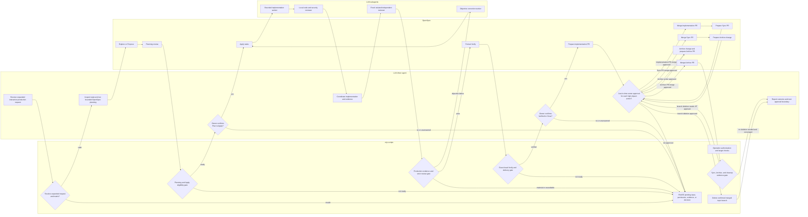
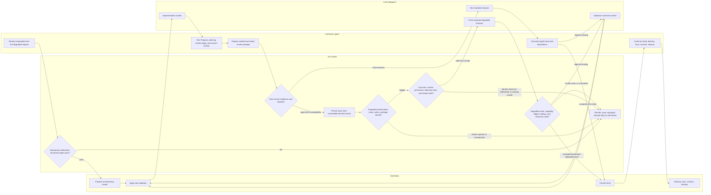
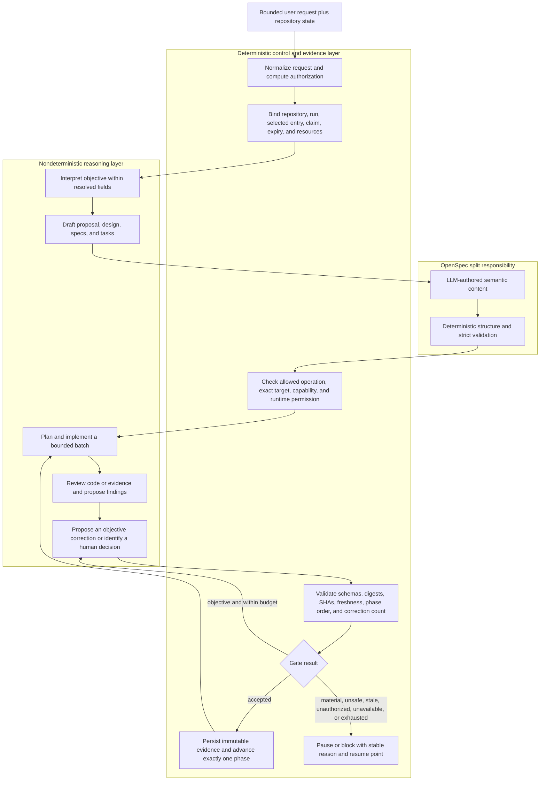

```mermaid
flowchart LR
  subgraph DRIVER_A["LLM driver agent"]
    direction TB
    A_D0["Receive ship-sdd target prod"]
    A_D1["Inspect Git, OpenSpec, GitHub, and durable evidence"]
    A_D2["Select first dependency-valid change"]
    A_D3["Orchestrate first incomplete phase"]
    A_D4["Assemble current evidence and proposed transition"]
    A_D5["Report completed, paused, blocked, or no-op"]
  end

  subgraph SCRIPTS_A[".mjs scripts"]
    direction TB
    A_S0{"Resolve request<br/>complete and valid?"}
    A_S1{"Admit or resume v2 run<br/>identity, expiry, claim unique?"}
    A_S2["Persist controller and register owned resources"]
    A_S3{"Phase gate<br/>first incomplete, in order, evidence current?"}
    A_S4{"Production quality gate<br/>tests, mapping, security, repeatability?"}
    A_S5{"Strict review gate<br/>exact package, isolated reviewer, accepted result?"}
    A_S6{"Delivery gate<br/>verified exact head and authorized target?"}
    A_S7{"Reconciliation gate<br/>Sync, Archive, issue, Project, cleanup?"}
    A_S8["Persist receipts, release claim, terminalize"]
    A_SP["PAUSE with durable reason and resume path"]
  end

  subgraph OPENSPEC_A["OpenSpec"]
    direction TB
    A_O0["Explore or Propose when needed"]
    A_O1["Planning review of proposal, design, specs, and tasks"]
    A_O2["Apply dependency-valid task batches"]
    A_O3["Formal Verify"]
    A_O4["Deliver implementation PR"]
    A_O5["Sync delta specs to living specs"]
    A_O6["Archive change"]
  end

  subgraph AGENTS_A["LLM subagents"]
    direction TB
    A_A0["Bounded planning or implementation worker"]
    A_A1["Local code and security review"]
    A_A2["Fresh isolated independent reviewer"]
    A_A3["Objective correction worker; max 3 strategies per signature"]
  end

  A_D0 --> A_S0
  A_S0 -- "no" --> A_SP
  A_S0 -- "yes" --> A_D1 --> A_D2 --> A_S1
  A_S1 -- "conflict, expiry, or claim failure" --> A_SP
  A_S1 -- "admitted" --> A_S2 --> A_S3
  A_S3 -- "propose" --> A_O0 --> A_O1
  A_O1 --> A_A0 --> A_S3
  A_S3 -- "apply" --> A_D3 --> A_O2
  A_O2 --> A_A0 --> A_A1 --> A_D4 --> A_S4
  A_S4 -- "objective failure" --> A_A3 --> A_O2
  A_S4 -- "material or exhausted" --> A_SP
  A_S4 -- "pass" --> A_A2 --> A_S5
  A_S5 -- "strict unavailable or invalid" --> A_SP
  A_S5 -- "objective finding" --> A_A3 --> A_O2
  A_S5 -- "accepted" --> A_O3
  A_O3 -- "fail" --> A_A3
  A_O3 -- "pass" --> A_S6
  A_S6 -- "not authorized or stale" --> A_SP
  A_S6 -- "pass" --> A_O4 --> A_O5 --> A_O6 --> A_S7
  A_S7 -- "incomplete or conflicting" --> A_SP
  A_S7 -- "converged" --> A_S8 --> A_D5
```

# Autonomous SDD: high-level design

- Status: current-state description
- As of: 2026-08-29
- Scope: the repository implementation of `sdd-delivery`, with emphasis on
  `production-rapid`

## Purpose

This document shows the major components of the SDD delivery framework and the
control flow between them. It describes the code as it exists; it is not a
proposal for a simpler replacement.

There are four participants:

| Participant | Primary responsibility |
| --- | --- |
| LLM driver agent | Interpret the bounded request, orchestrate the next phase, assemble evidence, and choose the next proposed action. |
| `.mjs` scripts | Normalize authorization; enforce identity, ordering, freshness, capability, and evidence gates; persist controller state and receipts. |
| OpenSpec | Hold the proposal, design, delta specs, tasks, living specs, and archive; provide lifecycle actions and strict validation. |
| LLM subagents | Perform bounded implementation or review work. Their output is advisory until deterministic contracts accept it. |

The driver is the orchestrator. The scripts are the control plane. OpenSpec is
the governed specification and task system. Subagents supply reasoning and
work products but do not own lifecycle state.

## Important current-state constraints

1. The literal `ship-sdd <target> prod [duration]` shorthand resolves only to
   `autonomous + production-rapid + strict-only`. The interactive and
   strict-first-degraded diagrams below show supported expanded request
   contracts, not additional shorthand aliases.
2. The v2 admission/controller path accepts `mode: autonomous` only. Interactive
   production uses the shared resolver, operation authorization, OpenSpec
   actions, and delivery gates, but it is not admitted as a v2 autonomous run.
3. “Rapid” removes repeated routine conversation. It does not remove tests,
   formal Verify, independent review, strict OpenSpec validation, exact-head
   binding, Sync, Archive, or cleanup.
4. A script returning “allowed” does not perform the whole workflow. The LLM
   driver still invokes the next bounded action and returns its evidence to the
   control plane.

## Using the conversion inputs in Lucidchart

Each diagram below has three copyable inputs:

1. **Lucid AI prompt:** Open a Lucidchart document, select the Lucid AI icon,
   and submit the prompt. For these complex diagrams, enable Plan mode first if
   it is available, review Lucid's proposed plan, and then generate. The result
   is made from editable canvas shapes and can be refined with follow-up
   prompts.
2. **Mermaid markup:** Select **Diagram as code** in the left toolbar, choose
   **+ New Mermaid diagram**, paste the code, and select **Generate**. Lucidchart
   currently documents Mermaid 11.14 compatibility. This version remains
   code-edited through the Mermaid editor.
3. **WebSequenceDiagrams markup:** Enable the **UML Sequence** shape library,
   select **Use Markup**, paste the sequence text, and select **Build**. The
   markup intentionally uses the common participant, message, note, `alt`,
   `opt`, and `loop` subset supported by both Lucid's UML sequence editor and
   WebSequenceDiagrams. In Lucidchart, keep the generated sequence grouped if
   you want to continue editing its source markup; ungrouping enables individual
   shape styling but ends markup editing. Add the section title as a separate
   Lucid text block; the sequence inputs omit WebSequenceDiagrams' `title`
   directive because Lucid's supported-markup page does not document it.

Lucid recommends detailed, specific prompts and iterative follow-up edits.
These prompts therefore state the diagram type, lane order, flow direction,
node types, branches, formatting rules, and explicit exclusions. Relevant
public documentation: [Lucid AI](https://help.lucid.co/hc/en-us/articles/30324063850516-Boost-productivity-with-Lucid-AI),
[Mermaid diagram as code](https://help.lucid.co/hc/en-us/articles/29549366940948-Diagram-as-code-with-Mermaid-in-Lucidchart),
[Lucid UML sequence markup](https://help.lucid.co/hc/en-us/articles/16262874090900-Create-a-sequence-diagram-with-UML-markup-in-Lucidchart),
and the [WebSequenceDiagrams reference](https://www.websequencediagrams.com/examples.html).
Lucid currently lists AI generation for Free, Individual, Team, and Enterprise
plans, subject to administrator controls; Mermaid diagram-as-code and UML
sequence markup are documented for Individual, Team, and Enterprise plans.

## A. Production strict autonomous

This is the mode selected by the current `ship-sdd <target> prod` shorthand.
Routine Plan-to-Apply and Verified-to-Close confirmations are absent, but all
safety, evidence, permission, and human-decision pauses remain.

### 1. Lucid AI prompt

```text
Create a professional cross-functional flowchart titled “Production strict autonomous SDD delivery”. Use exactly four vertical swimlanes, ordered left to right: “LLM driver agent”, “.mjs scripts”, “OpenSpec”, and “LLM subagents”. Time flows from top to bottom. Keep the diagram to the major lifecycle phases and gates only.

Use rounded rectangles for actions, diamonds for gates, and one clearly labeled pause terminator. Use short labels, orthogonal connectors, generous vertical spacing, and no crossed lines. Give each lane a subtle distinct fill while keeping action shapes neutral. Use green only for accepted/pass paths, amber for objective-correction loops, and red only for pause paths. Add a small legend. Do not invent components, deployment, release, or routine owner approval gates.

Show this exact flow:
1. Driver receives “ship-sdd <target> prod”.
2. Scripts resolve the request. Invalid or incomplete input goes to PAUSE.
3. Driver inspects Git, OpenSpec, GitHub, and durable evidence, then selects the first dependency-valid change.
4. Scripts admit or resume the v2 run, prove repository identity, expiry, and a unique active claim, then persist the controller and register owned resources. Any conflict goes to PAUSE.
5. Scripts select the first incomplete evidenced phase.
6. OpenSpec runs Explore or Propose when needed, followed by planning review.
7. OpenSpec applies dependency-valid task batches. An implementation worker may assist only when the resolved topology selects it.
8. A local code/security reviewer checks the batch. Scripts evaluate production evidence: tests, requirements mapping, security, regression, repeatability, operations, exact-head CI, and strict validation.
9. An objective failure loops through a correction worker back to Apply, with a maximum of three materially different strategies per failure signature. A material decision or exhausted budget goes to PAUSE.
10. A fresh isolated reviewer reviews the sealed exact-head package. Scripts validate reviewer capability, package identity, result, and dispositions. Strict unavailability, invalid evidence, or a material decision goes to PAUSE; an objective finding loops to correction.
11. OpenSpec runs formal Verify. Failure loops to correction; pass continues.
12. Scripts enforce the exact-head delivery gate. OpenSpec delivers the implementation PR, Syncs living specs, and Archives the change.
13. Scripts reconcile issue, Project, Archive, default branch, and every owned cleanup resource. Incomplete or conflicting state goes to PAUSE.
14. Scripts persist receipts, release the claim, terminalize the run, and the driver reports completed, paused, blocked, or no-op.

Visually emphasize that autonomous mode removes only routine Plan-to-Apply and Verified-to-Close confirmations; it does not remove quality, safety, permission, independent-review, delivery, Sync, Archive, or cleanup gates.
```

### 2. Mermaid markup



### 3. WebSequenceDiagrams markup

```text
participant Driver
participant Scripts
participant OpenSpec
participant Subagents

note over Driver: LLM driver agent
note over Scripts: Deterministic .mjs control plane
note over OpenSpec: Governed SDD artifacts and lifecycle actions
note over Subagents: Bounded implementation and review workers

Driver->Scripts: Resolve ship-sdd target prod
alt request invalid or incomplete
  Scripts-->Driver: PAUSE with clarification
else request resolved
  Driver->Driver: Inspect durable Git, OpenSpec, and GitHub state
  Driver->Driver: Select first dependency-valid change
  Driver->Scripts: Admit or resume v2 run
  alt identity, expiry, claim, or legacy conflict
    Scripts-->Driver: PAUSE with durable reason
  else admitted
    Scripts->Scripts: Persist controller and register resources
    Scripts->OpenSpec: Run first incomplete phase
    opt Propose is incomplete
      OpenSpec->Driver: Explore or Propose artifacts
      Driver->Subagents: Request bounded planning review
      Subagents-->Driver: Planning findings
      Driver->Scripts: Submit planning evidence
    end
    loop Each dependency-valid Apply batch
      Scripts->OpenSpec: Authorize Apply batch
      OpenSpec->Subagents: Implement bounded tasks when topology permits
      Subagents-->Driver: Changed artifacts and evidence
      Driver->Subagents: Request local code and security review
      Subagents-->Driver: Local review findings
      Driver->Scripts: Submit current quality evidence
      alt objective failure within correction budget
        Scripts-->Driver: Objective correction required
        Driver->Subagents: Apply behavior-preserving correction
      else material decision or budget exhausted
        Scripts-->Driver: PAUSE
      else quality gate passes
        Scripts-->Driver: Review package eligible
      end
    end
    Driver->Subagents: Invoke fresh isolated independent reviewer
    Subagents-->Scripts: Exact-package review result
    alt strict review unavailable, invalid, or material
      Scripts-->Driver: PAUSE
    else objective finding
      Scripts-->Driver: Correct and rerun affected evidence and review
    else review accepted
      Scripts->OpenSpec: Authorize formal Verify
      OpenSpec-->Scripts: Verify result
      alt Verify fails
        Scripts-->Driver: Objective correction or human decision
      else Verify passes
        Scripts->OpenSpec: Deliver implementation PR
        OpenSpec->OpenSpec: Sync living specs
        OpenSpec->OpenSpec: Archive change
        OpenSpec-->Scripts: Delivery, Sync, and Archive evidence
        alt reconciliation or cleanup incomplete
          Scripts-->Driver: PAUSE at first incomplete checkpoint
        else all terminal predicates pass
          Scripts->Scripts: Persist cleanup receipts and release claim
          Scripts-->Driver: Terminalized result
        end
      end
    end
  end
end
```

The diagram compresses the controller’s eight persisted phases—`propose`,
`planning-review`, `apply`, `verify`, `delivery`, `sync`, `archive`, and
`cleanup`—into the major visible transitions. Every resume returns to the first
incomplete evidenced phase; it does not restart from chat history.
Implementation subagents appear only when the resolved agent topology selects
them; the deterministic phase and evidence gates are the same for a
single-agent topology.

## B. Production strict interactive

This uses an expanded request with `mode: interactive`, `qualityProfile:
production-rapid`, and `reviewPolicy: strict-only`. It follows the same quality
path, but the owner remains an explicit gate at routine and high-impact
boundaries. The current v2 autonomous controller does not admit this mode.

### 1. Lucid AI prompt

```text
Create a professional cross-functional flowchart titled “Production strict interactive SDD delivery”. Use exactly four vertical swimlanes, ordered left to right: “LLM driver agent”, “.mjs scripts”, “OpenSpec”, and “LLM subagents”. Time flows from top to bottom. Use rounded rectangles for actions, diamonds for gates, and a single pause terminator reused by all stop paths.

Keep labels short, connectors orthogonal, spacing generous, and crossings to an absolute minimum. Give each lane a subtle distinct fill. Use green only for approved/pass paths, amber for objective-correction loops, blue for owner-approval gates, and red only for pause paths. Add a small legend. Do not show a v2 autonomous controller because the current controller rejects interactive mode. Do not invent deployment or release steps.

Show this exact flow:
1. Driver receives an expanded request with mode interactive, quality production-rapid, authorization sdd-delivery, and review strict-only.
2. Scripts resolve and validate the field matrix. Invalid input goes to PAUSE.
3. Driver inspects durable state. OpenSpec runs Explore or Propose and planning review.
4. Scripts evaluate planning and Apply eligibility.
5. Add a blue owner gate: “Confirm Plan to Apply?” No or unanswered goes to PAUSE; yes continues.
6. OpenSpec applies dependency-valid tasks. A bounded implementation worker and local code/security reviewer return current evidence.
7. A fresh isolated independent reviewer evaluates the sealed exact-head package. Scripts validate production evidence, review result, and dispositions. Objective failures loop through a bounded correction worker back to Apply. Material outcomes, unavailable strict review, or exhausted correction budget go to PAUSE.
8. OpenSpec runs formal Verify and scripts enforce the exact-head delivery gate.
9. Add a blue owner gate: “Confirm Verified to Close?” No or unanswered goes to PAUSE; yes continues.
10. Add a blue just-in-time owner approval gate before every high-impact action. Show separate approval points for the implementation PR merge, Sync PR merge, Archive action, Archive PR merge, and deleting the confirmed merged topic branch. Rejected or unanswered approval goes to PAUSE.
11. OpenSpec prepares and delivers the implementation, Syncs living specs through its own PR, and Archives the change through its own PR. Scripts validate reconciliation and cleanup evidence.
12. Driver reports the outcome and the next approval boundary.

Visually emphasize that interactive mode adds human gates but retains the same production quality, independent-review, Verify, exact-head, Sync, Archive, and cleanup requirements.
```

### 2. Mermaid markup



### 3. WebSequenceDiagrams markup

```text
participant Driver
participant Scripts
participant OpenSpec
participant Subagents

note over Driver: LLM driver agent plus owner interaction
note over Scripts: Resolver and deterministic operation gates; no v2 autonomous admission
note over OpenSpec: Governed SDD artifacts and lifecycle actions
note over Subagents: Bounded implementation and isolated review workers

Driver->Scripts: Resolve expanded interactive production request
alt request invalid or matrix conflict
  Scripts-->Driver: PAUSE with clarification
else request resolved
  Driver->Driver: Inspect durable state
  Driver->OpenSpec: Run Explore or Propose
  OpenSpec-->Driver: Proposal, design, specs, and tasks
  Driver->Subagents: Request planning review
  Subagents-->Driver: Planning findings
  Driver->Scripts: Submit planning and Apply evidence
  alt planning or Apply eligibility fails
    Scripts-->Driver: PAUSE
  else eligible
    Scripts-->Driver: Request owner Plan-to-Apply confirmation
    alt owner does not approve
      Driver->Driver: PAUSE pending owner decision
    else owner approves
      Driver->OpenSpec: Apply dependency-valid tasks
      OpenSpec->Subagents: Implement bounded batch
      Subagents-->Driver: Artifacts and test evidence
      Driver->Subagents: Request local code and security review
      Subagents-->Driver: Local findings
      Driver->Subagents: Invoke fresh isolated independent reviewer
      Subagents-->Scripts: Exact-package review result
      alt objective failure within budget
        Scripts-->Driver: Correct and rerun affected evidence and review
      else material, unavailable, or exhausted
        Scripts-->Driver: PAUSE
      else production review passes
        Scripts->OpenSpec: Authorize formal Verify
        OpenSpec-->Scripts: Verify result
        alt Verify or exact-head delivery gate fails
          Scripts-->Driver: PAUSE or objective correction
        else verified
          Scripts-->Driver: Request owner Verified-to-Close confirmation
          alt owner does not approve
            Driver->Driver: PAUSE pending owner decision
          else owner approves
            OpenSpec->OpenSpec: Prepare implementation PR
            Scripts-->Driver: Request JIT approval for implementation PR merge
            alt implementation merge not approved
              Driver->Driver: PAUSE
            else implementation merge approved
              Driver->OpenSpec: Merge implementation delivery
              OpenSpec->OpenSpec: Sync living specs and prepare Sync PR
              Scripts-->Driver: Request JIT approval for Sync PR merge
              alt Sync merge not approved
                Driver->Driver: PAUSE
              else Sync merge approved
                Driver->OpenSpec: Merge Sync PR
                OpenSpec->OpenSpec: Prepare Archive change
                Scripts-->Driver: Request JIT approval for Archive action
                alt Archive action not approved
                  Driver->Driver: PAUSE
                else Archive action approved
                  Driver->OpenSpec: Archive change and prepare Archive PR
                  Scripts-->Driver: Request JIT approval for Archive PR merge
                  alt Archive merge not approved
                    Driver->Driver: PAUSE
                  else Archive merge approved
                    Driver->OpenSpec: Merge Archive PR
                    OpenSpec-->Scripts: Reconciliation and cleanup evidence
                    Scripts-->Driver: Request JIT approval for merged branch deletion if needed
                    alt deletion not approved or cleanup ineligible
                      Driver->Driver: PAUSE
                    else cleanup approved and eligible
                      Scripts-->Driver: Report completed outcome
                    end
                  end
                end
              end
            end
          end
        end
      end
    end
  end
end
```

The two resolver-level blocking approvals are Plan-to-Apply and
Verified-to-Close. Separately, the operation checker requires just-in-time
approval for interactive production `merge-pr`, `archive-change`, and
`delete-merged-topic-branch` actions.

## C. Production strict-then-degraded autonomous

This uses an expanded request with `mode: autonomous`, `qualityProfile:
production-rapid`, and `reviewPolicy: strict-first-degraded`. The lifecycle is
the same as A except for the review branch shown below. Degraded review is not
an automatic weakening: it is an exact, expiring, owner-selected authorization
that becomes eligible only after durable strict unavailability.

### 1. Lucid AI prompt

```text
Create a professional cross-functional flowchart titled “Production strict-first-degraded autonomous SDD delivery”. Use exactly four vertical swimlanes, ordered left to right: “LLM driver agent”, “.mjs scripts”, “OpenSpec”, and “LLM subagents”. Time flows from top to bottom. Focus on the independent-review decision branch while showing compact upstream and downstream lifecycle context.

Use rounded rectangles for actions, diamonds for gates, and one pause terminator. Keep labels short, use orthogonal connectors, leave generous whitespace around the fallback branch, and avoid crossed lines. Give each lane a subtle distinct fill. Use green for accepted strict review, amber for the explicitly authorized degraded path and objective-correction loop, and red only for pause paths. Add a legend that states “amber = authorized reduced assurance, not strict isolation”. Do not depict manual command relay, owner-executed fallback, self-review, deployment, or release.

Show this exact flow:
1. Driver resolves the expanded autonomous production strict-first-degraded request.
2. Scripts admit or resume the autonomous run and enforce normal phase gates. Failure goes to PAUSE.
3. OpenSpec completes Propose, planning review, Apply, and current production checks. An implementation worker may assist.
4. Driver prepares a sealed review package bound to exact base commit, head commit, manifest, selected change, transition, and expiration.
5. Scripts run strict review readiness and dispatch. A fresh isolated reviewer executes.
6. If the strict result is valid and accepted, go directly to formal Verify.
7. If the result has an objective finding, loop through a bounded behavior-preserving correction, rerun affected checks, create a new exact-head package, and repeat the complete strict-first review path.
8. If strict review is unavailable, scripts first persist one exact terminal strict-unavailable record. Do not treat a transcript or attempted command as evidence.
9. Scripts validate an exact active degraded authorization bound to the selected change, merge transition, package, strict precursor, correction envelope, and expiry. Invalid or mismatched authorization goes to PAUSE.
10. Scripts validate launcher capability, runtime permission, detached review view, parent-owned request and receipt, result artifact, and safe cleanup. Denial, timeout, malformed evidence, identity mismatch, or unsafe cleanup goes to PAUSE.
11. A fresh separate degraded reviewer runs with the configured restricted boundary.
12. Scripts validate the authorized-degraded assurance label, capability ledger, package freshness, strict precursor, authorization binding, findings, and dispositions. Invalid, stale, or unresolved evidence goes to PAUSE. Objective findings loop to correction and restart the full strict-first path.
13. An accepted authorized-degraded result continues to OpenSpec formal Verify, then delivery, Sync, Archive, cleanup, and terminalization under the normal autonomous gates.

Include a note beside the degraded branch: “Fresh and package-bound, but parent-launch and executable identity are not cryptographically authenticated as a strict security boundary.”
```

### 2. Mermaid markup



### 3. WebSequenceDiagrams markup

```text
participant Driver
participant Scripts
participant OpenSpec
participant Subagents

note over Driver: LLM driver agent
note over Scripts: Deterministic authorization, transport, package, and evidence gates
note over OpenSpec: Propose, Apply, Verify, delivery, Sync, Archive, cleanup
note over Subagents: Implementation, strict reviewer, and fresh degraded reviewer

Driver->Scripts: Resolve strict-first-degraded autonomous request
Scripts->Scripts: Admit run and validate phase gates
alt admission or phase gate fails
  Scripts-->Driver: PAUSE
else admitted
  Scripts->OpenSpec: Run Propose and planning review
  OpenSpec->Subagents: Apply bounded implementation tasks
  Subagents-->Driver: Current artifacts and evidence
  Driver->Scripts: Build sealed exact-head review package
  Scripts->Subagents: Invoke strict isolated reviewer
  Subagents-->Scripts: Strict terminal result
  alt strict review accepted
    Scripts->OpenSpec: Authorize formal Verify
  else objective finding within correction budget
    Scripts-->Driver: Apply behavior-preserving correction
    Driver->OpenSpec: Correct implementation and rerun checks
    note over Driver, Scripts: New head invalidates prior evidence; repeat complete strict-first path
  else strict review unavailable
    Scripts->Scripts: Persist exact strict-unavailable terminal record
    Scripts->Scripts: Validate degraded authorization
    alt authorization invalid, expired, or package mismatched
      Scripts-->Driver: PAUSE
    else degraded fallback eligible
      Scripts->Scripts: Validate launcher, runtime permission, detached view, and parent receipt
      alt transport denied, timed out, malformed, mismatched, or cleanup unsafe
        Scripts-->Driver: PAUSE without manual relay
      else recovery transport valid
        Scripts->Subagents: Invoke fresh separate degraded reviewer
        Subagents-->Scripts: Authorized-degraded result and capability ledger
        alt result invalid, stale, unresolved, or authorization mismatched
          Scripts-->Driver: PAUSE
        else objective finding within correction budget
          Scripts-->Driver: Correct, rerun checks, and restart strict-first path
        else authorized-degraded result accepted
          note over Scripts, Subagents: Reduced assurance; not strict OS isolation
          Scripts->OpenSpec: Authorize formal Verify
        end
      end
    end
  else strict result material or malformed
    Scripts-->Driver: PAUSE
  end
  opt accepted current strict or authorized-degraded review exists
    OpenSpec-->Scripts: Formal Verify result
    alt Verify passes with accepted current review
      Scripts->OpenSpec: Continue delivery, Sync, Archive, and cleanup
      OpenSpec-->Driver: Terminal lifecycle result
    else Verify fails
      Scripts-->Driver: Objective correction or human decision
    end
  end
end
```

The degraded path preserves a fresh reviewer and package binding, but the code
explicitly records weaker assurance: its parent-launch evidence and executable
identity are not cryptographically protected as a strict security boundary.

## Deterministic framework versus LLM behavior

The framework is not deterministic end to end. It is a deterministic envelope
around nondeterministic reasoning and generation.

### 1. Lucid AI prompt

```text
Create a clean systems-boundary flowchart titled “Deterministic SDD control plane around LLM reasoning”. This is not a lifecycle swimlane diagram. Use three clearly labeled vertical containers from left to right: “Nondeterministic LLM reasoning”, “OpenSpec split responsibility”, and “Deterministic control and evidence”. Place a single input banner across the top labeled “Bounded user request + current repository state”.

Use a restrained architecture-diagram style with short labels, orthogonal connectors, and no decorative icons. Use one subtle color for LLM reasoning, a split or two-part color for OpenSpec, and a neutral control-plane color. Use a diamond for the deterministic gate result. Use green for accepted transitions, amber for objective-correction feedback, and red for pause/block. Avoid crossed connectors and keep the feedback loops on the outer edges.

Show these responsibilities:
- LLM reasoning: interpret the objective only within resolved fields; draft proposal, design, specs, and tasks; plan and implement a bounded batch; review code or evidence; propose an objective correction or identify a human decision.
- OpenSpec: semantic artifact content is LLM-authored, while structure, status, and strict validation are deterministic.
- Deterministic control: normalize request and compute authorization; bind repository, run, selected entry, claim, expiry, and owned resources; check allowed operation, exact target, adapter capability, and runtime permission; validate schemas, digests, commits, freshness, phase order, and correction count; persist immutable evidence and advance exactly one phase.

Show this control flow:
1. Input enters request normalization and durable binding.
2. The accepted envelope constrains LLM interpretation and artifact authoring.
3. OpenSpec semantic content passes through deterministic OpenSpec structure and strict validation.
4. The driver proposes a bounded action and evidence package to the deterministic gate.
5. Gate outcome “accepted” persists evidence, advances exactly one phase, and returns the next incomplete phase to the LLM.
6. Gate outcome “objective and within budget” returns a correction request to the LLM and then re-evaluates the same gate.
7. Gate outcome “material, unsafe, stale, unauthorized, unavailable, unknown, or exhausted” goes to PAUSE or BLOCK with a stable reason and resume point.

Add a bottom note spanning the diagram: “Deterministic controls prove authorization, identity, order, freshness, and evidence shape. They do not prove that an LLM-authored product decision is correct.”
```

### 2. Mermaid markup



### 3. WebSequenceDiagrams markup

```text
participant User
participant Driver
participant OpenSpec
participant Scripts

note over User, Scripts: Deterministic envelope around nondeterministic reasoning

User->Scripts: Bounded request and current repository state
Scripts->Scripts: Normalize fields and compute authorization
Scripts->Scripts: Bind repository, run, selected entry, claim, expiry, and resources
alt request or durable binding invalid
  Scripts-->User: PAUSE with stable reason and resume input
else deterministic envelope accepted
  Scripts-->Driver: Return authorized first incomplete phase
  Driver->Driver: Interpret objective within resolved fields
  Driver->OpenSpec: Draft semantic proposal, design, specs, and tasks
  OpenSpec->OpenSpec: Validate structure, status, and strict schema
  OpenSpec-->Driver: Current artifact state
  loop Each proposed lifecycle action
    Driver->Driver: Plan, implement, or review bounded work
    Driver->Scripts: Submit proposed action and evidence package
    Scripts->Scripts: Check operation, exact target, capability, and runtime permission
    Scripts->Scripts: Validate digests, commits, freshness, order, and correction count
    alt gate accepted
      Scripts->Scripts: Persist immutable evidence and advance exactly one phase
      Scripts-->Driver: Return next incomplete phase
    else objective failure within budget
      Scripts-->Driver: Request bounded behavior-preserving correction
      Driver->Driver: Correct and rerun affected evidence
    else material, unsafe, stale, unauthorized, unavailable, unknown, or exhausted
      Scripts-->Driver: PAUSE or BLOCK with stable reason and resume point
    end
  end
end

note over Driver, Scripts: Controls prove authorization, identity, order, freshness, and evidence shape; semantic correctness still requires reasoning and review.
```

The deterministic layer can prove that an action is authorized, ordered,
fresh, identity-bound, and supported by the required evidence shape. It cannot
prove that an LLM-authored requirement is the right product decision or that an
implementation is semantically perfect. Those remain reasoning and review
problems, contained by evidence gates and human-decision boundaries.

## Major checkpoints

| Checkpoint | Deterministic evidence | LLM responsibility |
| --- | --- | --- |
| Request resolved | Complete valid field matrix, exact expiry, mutation allowlist | Explain intent without inventing risk-bearing fields |
| Run admitted | Canonical repository identity, one active claim, immutable controller identity | Select only the authorized change |
| Planning reviewed | Required artifacts and planning evidence present | Judge scope, ambiguity, dependencies, security, and recovery |
| Apply eligible | Correct phase, task dependencies, review readiness, active claim | Implement a bounded dependency-valid batch |
| Evidence current | Tests, validation, mapping, security, exact head | Diagnose and correct objective failures |
| Review accepted | Sealed package, reviewer capability, exact base/head, valid result and dispositions | Independent reviewer evaluates semantics and risk |
| Verify accepted | Every task and requirement mapped to current evidence | Explain known limitations and resolve findings |
| Delivery bound | Exact PR, merge, delivered head, issue and Project identity | Prepare bounded PR content and reconcile intent |
| Sync and Archive | Living specs reflect deltas; archive is current and content-preserving | Resolve semantic conflicts instead of guessing |
| Cleanup and terminalization | Every owned resource has current eligibility and a persisted receipt; claim released | Report completion only from durable terminal evidence |

## Primary implementation sources

- [Request resolver](../../../scripts/sdd/resolve-sdd-delivery-request.mjs)
- [Autonomous lifecycle](../../../skills/base/autonomous-sdd-lifecycle/SKILL.md)
- [Autonomous admission](../../../scripts/sdd/autonomous-sdd-admission.mjs)
- [Controller](../../../scripts/sdd/autonomous-sdd-controller.mjs)
- [Operation contract](../../../scripts/sdd/autonomous-sdd-operation-contract.mjs)
- [Operation authorization](../../../scripts/sdd/check-operation-authorization.mjs)
- [Independent review executor](../../../scripts/sdd/execute-independent-review.mjs)
- [OpenSpec action gates](../../../skills/base/autonomous-sdd-lifecycle/references/openspec-actions.md)
- [Delivery gates](../../../skills/base/autonomous-sdd-lifecycle/references/delivery.md)
